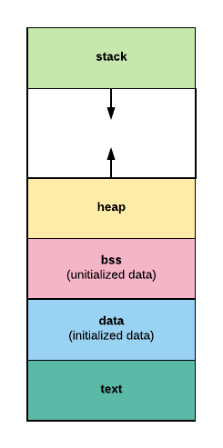

# golang快速入门[8.1]-变量类型、声明赋值、作用域声明周期与变量内存分配

## 前文
* [golang快速入门[1]-go语言导论](https://zhuanlan.zhihu.com/p/107658283)
* [golang快速入门[2.1]-go语言开发环境配置-windows](https://zhuanlan.zhihu.com/p/107659334)
* [golang快速入门[2.2]-go语言开发环境配置-macOS](https://zhuanlan.zhihu.com/p/107661202)
* [golang快速入门[2.3]-go语言开发环境配置-linux](https://zhuanlan.zhihu.com/p/107662649)
* [golang快速入门[3]-go语言helloworld](https://zhuanlan.zhihu.com/p/107664129)
* [golang快速入门[4]-go语言如何编译为机器码](https://zhuanlan.zhihu.com/p/107665043)
* [golang快速入门[5.1]-go语言是如何运行的-链接器](https://zhuanlan.zhihu.com/p/107665658)
* [golang快速入门[5.2]-go语言是如何运行的-内存概述](https://zhuanlan.zhihu.com/p/107807229)
* [golang快速入门[5.3]-go语言是如何运行的-内存分配](https://zhuanlan.zhihu.com/p/108598942)
* [golang快速入门[6.1]-集成开发环境-goland详解](https://zhuanlan.zhihu.com/p/109564120)
* [golang快速入门[6.2]-集成开发环境-emacs详解](https://zhuanlan.zhihu.com/p/110003756)
* [golang快速入门[7.1]-项目与依赖管理-gopath](https://zhuanlan.zhihu.com/p/110526009)
* [golang快速入门[7.2]-北冥神功—go module绝技](https://zhuanlan.zhihu.com/p/111409419)

## 题记
* 在上一篇文章中,我们介绍了吸心大法—go module的技巧来引用第三方代码,但是看过武侠小说的同学都知道，只有内力没有招式那也是花架子。正所谓"巧妇难为无米之炊",我们将在后面几章介绍go语言的语法、基本概念和性质。
## 前言
我们将在本文中学习到：
* 变量的内涵
* 变量的数据类型
* 变量的多种声明与赋值
* 变量的命名
* 变量的作用域与示例
* 变量的内存分配方式

## 变量是什么
* 在计算机编程中,变量(Variable)是与关联的`符号名`配对的存储地址(内存地址标识)
* 变量用于存储要在计算机程序中引用和操作的信息。变量还提供了一种使用描述性名称标记数据的方法，因此读者和开发人员都可以更清楚地理解程序。可以将将变量视为保存信息的空间。
* 编译器必须用数据的实际地址替换变量的符号名。尽管变量的名称，类型和地址通常保持不变，但存储在地址中的数据可能会在程序执行期间发生更改。

## 变量的数据类型
静态语言与动态语言差别
* 数据类型是数据的属性，它告诉编译器打算如何使用数据。
* 大多数编程语言都支持基本数据类型，包括整数，浮点数，字符和布尔值等。数据类型定义了可以对数据执行的操作，数据的含义以及该类型值的存储方式
* Go语言的数值类型包括几种不同大小的整形数、浮点数和复数。每种数值类型都决定了对应的大小范围和是否支持正负符号。让我们先从整型数类型开始介绍。
* Go语言同时提供了有符号和无符号类型的整数运算，有int8、int16、int32和int64四种截然不同大小的有符号整型数类型，分别对应8、16、32、64bit大小的有符号整型数，与此对应的是uint8、uint16、uint32和uint64四种无符号整型数类型。
* 还有两种一般对应特定CPU平台机器字大小的有符号和无符号整数int和uint。其中int是应用最广泛的数值类型。这两种类型都有同样的大小，32或64bit，但是我们不能对此做任何的假设；因为不同的编译器卽使在相同的硬件平台上可能产生不同的大小。
* Unicode字符rune类型是和int32等价的类型，通常用于表示一个Unicode码点。这两个名称可以互换使用。同样byte也是uint8类型的等价类型，byte类型一般用于强调数值是一个原始的数据而不是一个小的整数。
* 最后，还有一种无符号的整数类型uintptr，没有指定具体的bit大小但是足以容纳指针。uintptr类型只有在底层编程是才需要，特别是Go语言和C语言函数库或操作系统接口相交互的地方。在介绍指针时，会详细介绍它。

## 变量的声明与赋值
变量的声明使用`var`来标识,变量声明的通用格式如下:
```
var name type = expression
```
* 函数体外部:变量声明方式1

```
var i int
```
* 函数体外部:变量声明方式2

```
// 外部连续声明
var U, V, W float64
```
* 函数体外部:变量声明方式3
```
// 赋值不带类型,自动推断
var k = 0
```

* 函数体外部:变量声明方式4
```
// 外部连续声明+赋值
var x, y float32 = -1, -2
```

* 函数体外部:变量声明方式5
```
// 外部var括号内部
var (
	g       int
	u, v, s = 2.0, 3.0, "bar"
)
```

* 函数体内部:变量声明方式6
```
func main() {
	//函数内部的变量声明  声明的变量类型必须使用 否则报错
	var x string
```

* 函数体内部:变量声明方式7
```
// 只限函数内部 自动推断类型
y := "jonson"
```

## 变量的命名
* 名字的长度没有逻辑限制，但是Go语言的风格是尽量使用短小的名字，对于局部变量尤其是这样；你会经常看到i之类的短名字，而不是冗长的theLoopIndex命名。通常来说，如果一个名字的作用域比较大，生命周期也比较长，那么用长的名字将会更有意义。
* 在习惯上，Go语言程序员推荐使用 驼峰式 命名，当名字由几个单词组成时优先使用大小写分隔，而不是优先用下划线分隔。因此，在标准库有QuoteRuneToASCII和parseRequestLine这样的函数命名，但是一般不会用quote_rune_to_ASCII和parse_request_line这样的命名。而像ASCII和HTML这样的缩略词则避免使用大小写混合的写法，它们可能被称为htmlEscape、HTMLEscape或escapeHTML，但不会是escapeHtml。

## 作用域
* 在程序设计中，一段程序代码中所用到的标识符并不总是有效/可用的，作用域就是标识符可用性的代码范围。
* 在go语言中,作用域可以分为
```
全局作用域 > 包级别作用域 > 文件级别作用域 > 函数作用域 > 内部作用域
universe block > package block > file block > function block > inner block
```
#### 全局作用域
* 全局作用域主要是go语言预声明的标识符，所有go文件都可以使用。主要包含了如下的标识符
```

內建类型: int int8 int16 int32 int64
          uint uint8 uint16 uint32 uint64 uintptr
          float32 float64 complex128 complex64
          bool byte rune string error

內建常量: true false iota nil

內建函數: make len cap new append copy close delete
          complex real imag
          panic recover
```

#### 包级别作用域
* 全局（任何函数之外）声明的常量，类型，变量或函数的标识符是包级别作用域
* 如下例中的变量x 以及 fmt包中的函数println 就是package scope
```go
package main

import "fmt"

var x int=5

func main(){

	fmt.Println("mainx:",x)
}
```
* 调用例子1

```go
// f1.go
package main

var x int
//-------------------------------------
// f2.go
package main

func f() {
  fmt.Println(x)
}
```
* 调用例子2：调用另一个包中的函数和属性：
```go
//testdemo/destdemo.go
package testdemo

import "fmt"

var Birth uint = 23
func Haha(){
    fmt.Println("lalalal")
}
//-------------------------------------
package main  // main/scope.go

import (
    "testdemo"
    "fmt"
)

func main(){

    testdemo.Haha()
    fmt.Println(testdemo.Birth)
}
```
* 注意：如果要让包中的属性和变量被外部包调用，必须要首字母大写。

####  文件级别作用域
* import包的标识符是文件级别作用域的，只能够在本文件中使用
* 例如下面的代码无效，因为import 是file block,不能跨文件
```go
// f1.go
package main

import "fmt"
//-------------------------------------
// f2.go  无效
package main

func f() {
  fmt.Println("Hello World")
}
```
####  函数级别作用域
* 方法接收者（后面介绍）,函数参数和结果变量的标识符的范围是函数级别作用域，在函数体外部无效,在内部任何位置可见
* 例如下面函数中的a,b,c就是函数级别作用域
```
func  add(a int,b int)(c int) {
  fmt.Println("Hello World")
  x := 5
  fmt.Println(x)
}
```

#### 内部作用域
* 函数声明的常量和变量是函数内部作用域,其作用域从声明开始,到最近的一个花括号结束。
* 例子1：注意参数的前后顺序
```
//下面的代码无效：
func main() {
  fmt.Println("Hello World")

  fmt.Println(x)
    x := 5
}
```

* 例子2：参数不能跨函数使用
```
//下面的代码无效2：
func main() {
  fmt.Println("Hello World")
  x := 5
  fmt.Println(x)
}
//
func test(){
    fmt.Println(x)
}
```
* 例子3：函数内部变量与外部变量重名,使用就近原则
```go
package main

import "fmt"

var x int=5

func test(){

	var x int = 99;
	x = 100;
	// 下面的代码输出结果为: 100
	fmt.Println("testx",x)
}
```
* 例子4：内部花括号
* 变量x的作用域是从scope3到scope5为止
```
func main() {
    fmt.Println("Hello World")  // scope1
    {                           // scope2
        x := 5                  // scope3
        fmt.Println(x)          // scope4
    }                           // scope5
}
```

#### 变量的内存分配
我们在前文[go语言是如何运行的-内存概述](https://zhuanlan.zhihu.com/p/107807229) 与 [go语言是如何运行的-内存分配](https://zhuanlan.zhihu.com/p/108598942) 中,详细介绍了在虚拟内存角度其不同的`段`及其功能



* 对于全局变量,其存储在`.data` 和`.bss`段。 我们可以用下面的实例来验证
```
// main.go
package main

var aaa int64 = 8
var ddd int64
func main() {
}
```

* 在终端中输入如下指令打印汇编代码
```
$ go tool compile -S main.go

...
"".aaa SNOPTRDATA size=8
        0x0000 08 00 00 00 00 00 00 00
"".ddd SNOPTRBSS size=8
...

```
* 从上面的汇编输出中可以看出, 变量`aaa`位于 `.data`段中, 变量`ddd`位于`.bss`段
* 对于函数的内部变量，在go语言的编程规范中并没有明确的划分,变量是分配在栈中还是堆中，簡單來說，Go语言的逃逸分析(escape analysis)会分析各个变量的使用狀況，來決定他要放在stack还是heap段。
* 一般的变量会在运行时在栈中创建，随着函数的调用而产生,随着函数的结束而消亡。如果编译器无法证明函数返回后未引用该变量，则编译器必须在堆上分配该变量，以避免悬空指针错误。另外，如果局部变量很大，则将其存储在堆而不是堆栈上可能更有意义
* 有一些初始化的情况会被分配到`.data`段中，例如`长度大于4`的数组字面量、`字符串` 等,如下所示
```
func main() {
	var vvv  = [5]int{1,2,3,4,5}
	var bbb string = "hello"
}
```
* 在终端中输入如下指令打印汇编代码 即可验证
```
$ go tool compile -S main.go
...
go.string."hello" SRODATA dupok size=5
	0x0000 68 65 6c 6c 6f                                   hello
type.[5]int SRODATA dupok size=72
"".ddd SNOPTRBSS size=8
...

```
## 总结

## 参考资料
* [项目链接](https://github.com/dreamerjackson/theWayToGolang)
* [作者知乎](https://www.zhihu.com/people/ke-ai-de-xiao-tu-ji-71)
* [blog](https://dreamerjonson.com/)
* [Variables](http://www.golang-book.com/books/web/01-02)
* [stack_or_heap](https://golang.org/doc/faq#stack_or_heap)
