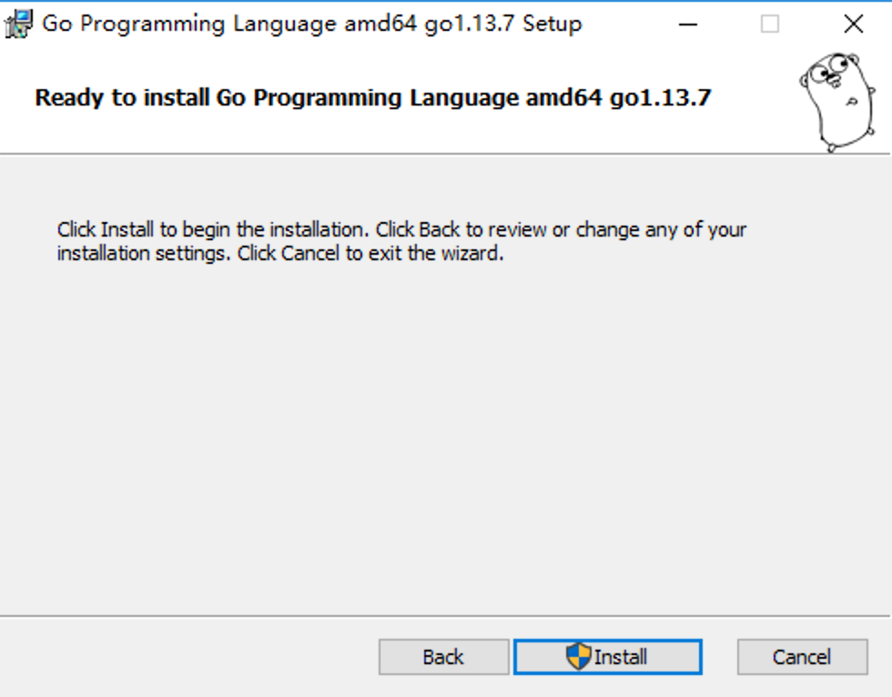
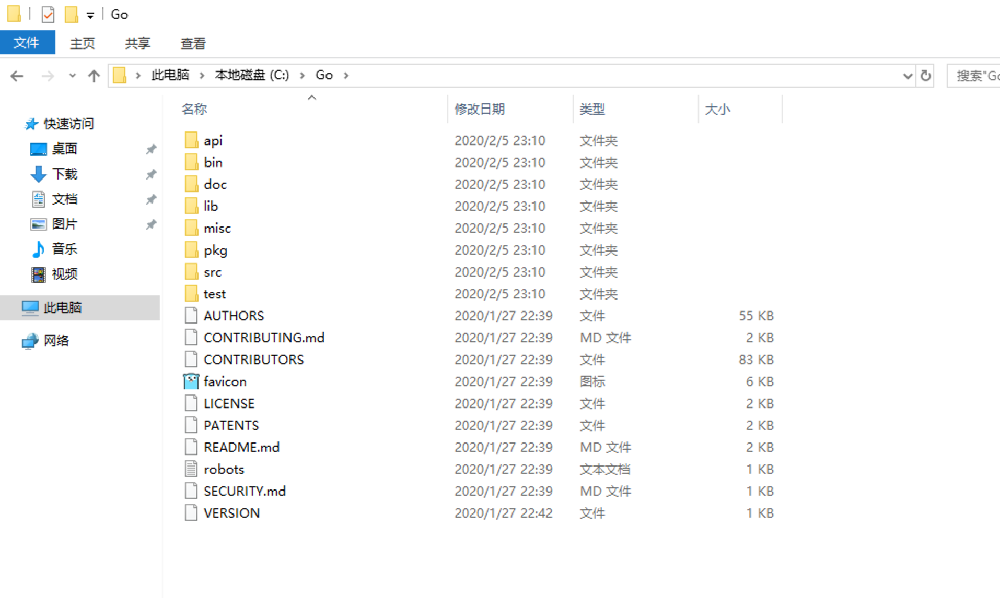

# golang快速入门[2.1]-go语言开发环境配置-windows
* 本文将讲解在windows系统下构建go语言的开发环境

## windows安装Go语言开发包
* 配置go语言的开发环境的第一步是要在[go官网下载页面](https://golang.google.cn/dl/)下载开发包
* windows系统下需要下载msi后缀文件，msi是windows下的安装包文件格式,用于安装，存储和删除程序


* 上图中是 64 位的开发包，如果读者的电脑是 32 位系统或者有特殊的软件需求，则需要下载 32 位的开发包
* 如下图所示为windows下32位系统的开发包


* 双击后即可启动程序，如下图所示，这是Go语言的用户许可协议，直接点击勾选即可。


* Go语言开发包会默认安装到 C 盘的 Go 目录下，这就是叫做GOROOT的目录，推荐使用此目录，也可以选择任意的目录。如下图所示，确认无误后点击“Next”


* 如下图所示，点击“Install”即可开始安装，没有其他需要配置的操作


* 等待程序完成安装，点击“Finish”完成安装。


* 安装完成后，在我们所设置的安装目录下(c:/go)将生成特定的文件和文件夹，如下图所示：



## 设置环境变量
* 开始写 go 项目代码之前，需要我们先配置好GOPATH环境变量，GOPATH是go中的一个重要概念，我们在之后的文章中会详细介绍
* 如下图所示，在桌面或者资源管理器右键 我的电脑 - 属性 - 高级系统设置 - 环境变量。


* 在弹出的界面里点击 GOPATH 对应的选项，点击编辑之后就可以对GOPATH进行修改。
* 如果没有GOPATH环境变量，则可以点击新建进行创建。
* GOPATH可以设置为任何目录，但是尽量选择新的空目录，例如 :\Go。


* 提示：填写完成后，每个打开的窗口都需要点击“确定”来保存设置。
* 其它的Go环境变量会由安装包自动设置。
* 在任意目录下使用终端执行 go env 命令，输出如下结果说明Go语言开发包已经安装成功
```
C:\Windows\system32> go env
set GO111MODULE=
set GOARCH=amd64
set GOBIN=
set GOCACHE=C:\Users\jackson\AppData\Local\go-build
set GOENV=C:\Users\jackson\AppData\Roaming\go\env
set GOEXE=.exe
set GOFLAGS=
set GOHOSTARCH=amd64
set GOHOSTOS=windows
set GONOPROXY=
set GONOSUMDB=
set GOOS=windows
set GOPATH=C:\Users\jackson\go
set GOPRIVATE=
set GOPROXY=https://proxy.golang.org,direct
set GOROOT=c:\go
...
```
## 参考资料
* [在Windows上安装Go语言开发包](http://c.biancheng.net/view/3992.html)
