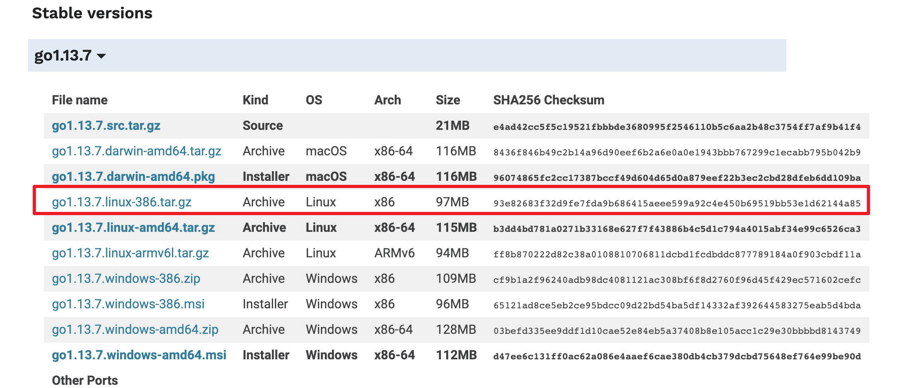

# golang快速入门[2.3]-go语言开发环境配置-linux
## linux安装Go语言开发包
* 默认读者会使用linux的基本操作
* 配置go语言的开发环境的第一步是要在[go官网下载页面](https://golang.google.cn/dl/)下载开发包
* linux需要下载tar.gz压缩文件


* 这里我们下载的是 64 位的开发包，如果读者的电脑是 32 位系统或者有特殊的需求，则需要下载 32 位的开发包
* 在上图所示页面中向下滚动即可找到 32 位开发包的下载地址，如下图所示


* 注意，如果在ubuntu这样有图形化界面的linux操作系统，我们可以直接下载
* 没有图形化界面时，我们需要在命令行中操作
* 第一步：下载开发包
```
wget https://dl.google.com/go/go1.13.7.linux-amd64.tar.gz
--2020-02-06 14:18:58--  https://dl.google.com/go/go1.13.7.linux-amd64.tar.gz
Resolving dl.google.com (dl.google.com)... 203.208.50.168, 203.208.50.166, 203.208.50.163, ...
Connecting to dl.google.com (dl.google.com)|203.208.50.168|:443... connected.
HTTP request sent, awaiting response... 200 OK
Length: 120071076 (115M) [application/octet-stream]
Saving to: 'go1.13.7.linux-amd64.tar.gz'
2020-02-06 14:19:19 (7.72 MB/s) - 'go1.13.7.linux-amd64.tar.gz' saved [120071076/120071076]
```

* 使用tar 命令解压刚刚下载的Go语言开发包到/usr/local目录
```
>> tar -C /usr/local -xzf go1.13.7.linux-amd64.tar.gz
```
* 解压成功后会在/usr/local目录下新增一个 go 目录，至此我们的Go语言开发包就安装完成了。
* 使用`cd /usr/local/go`命令进入该目录，然后执行bin/go version 命令就可以查看当前Go语言的版本了。
```
>> bin/go version
go version go1.13.7 linux/amd64
```
* 使用ls命令，列出当前目录下的文件和文件夹
```
ls
AUTHORS  CONTRIBUTING.md  CONTRIBUTORS  LICENSE  PATENTS  README.md  SECURITY.md  VERSION  api  bin  doc  favicon.ico  lib  misc  pkg  robots.txt  src  test
```
* 这个目录的结构遵守 GOPATH 规则，后面的章节会提到这个概念。目录中各个文件夹的含义如下表所示。

| 目录名 | 说明                                                                  |
|--------|-----------------------------------------------------------------------|
| api    | 每个版本的 api 变更差异                                               |
| bin    | go 源码包编译出的编译器（go）、文档工具（godoc）、格式化工具（gofmt） |
| doc    | 英文版的 Go 文档                                                      |
| lib    | 引用的一些库文件                                                      |
| misc   | 杂项用途的文件，例如 Android 平台的编译、git 的提交钩子等             |
| pkg    | linux 平台编译好的中间文件                                          |
| src    | 标准库的源码                                                          |
| test   | 测试用例                                                              |


## 设置 GOPATH 环境变量
* 开始写 go 项目代码之前，需要我们先配置好环境变量。
* 需要把这几个环境变量添加 profile 文件中（~/.bash_profile 或 /etc/profile）。
* 如果是单用户使用，可以将环境变量添加在 home 目录下的 bash_profile 文件中，如果是多用户使用，需要添加在 /etc/profile 文件。（推荐大家在 /etc/profile 文件中设置环境变量）
* 使用编辑器例如`vim /etc/profile` 命令打开 profile 文件，并将下面的环境变量添加到文件末尾。
* 添加完成后使用:wq 命令保存并退出。
* 然后，使用 `source /etc/profile` 命令使配置文件生效，现在就可以在任意目录使用Go语言命令了。

```
export GOROOT=/usr/local/go
export PATH=$PATH:$GOROOT/bin
```
* 在任意目录下使用终端执行 go env 命令，输出如下结果说明Go语言开发包已经安装成功
```
>> go env
GO111MODULE=""
GOARCH="amd64"
GOBIN=""
GOCACHE="/root/.cache/go-build"
GOENV="/root/.config/go/env"
GOEXE=""
GOFLAGS=""
GOHOSTARCH="amd64"
GOHOSTOS="linux"
GONOPROXY=""
GONOSUMDB=""
GOOS="linux"
GOPATH="/root/go"
GOPRIVATE=""
GOPROXY="https://proxy.golang.org,direct"
GOROOT="/usr/local/go"
```
## 参考资料
* [在Linux上安装Go语言开发包](http://c.biancheng.net/view/3993.html)
