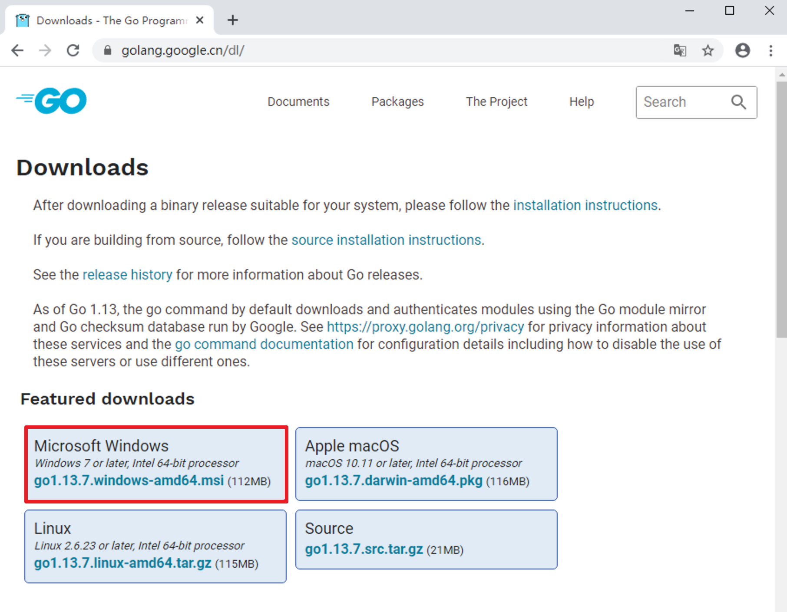
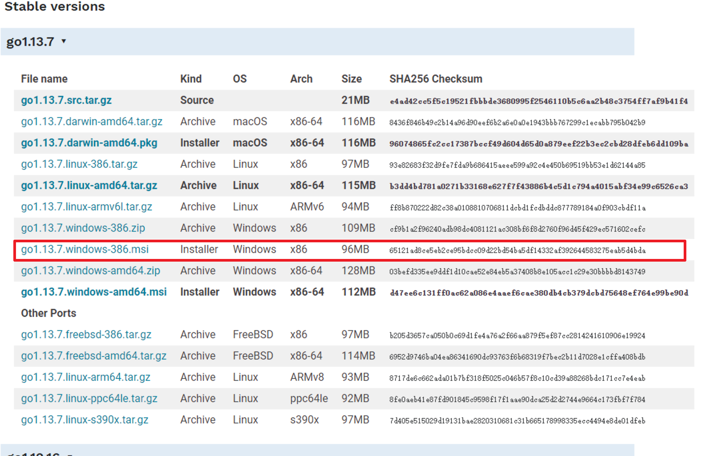
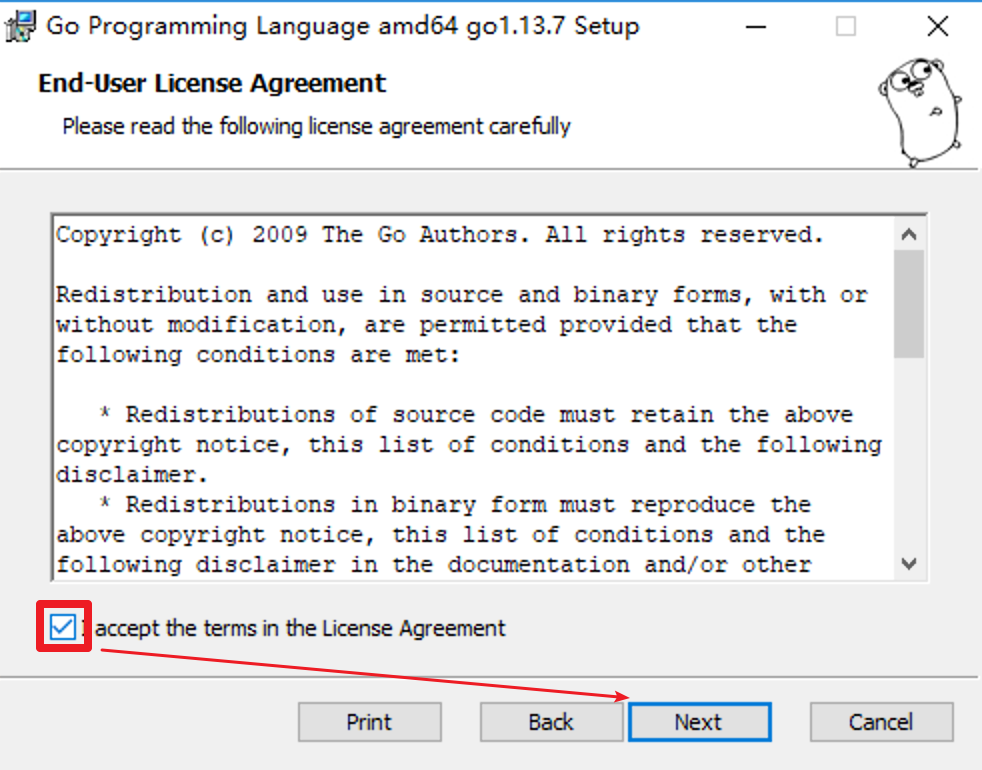
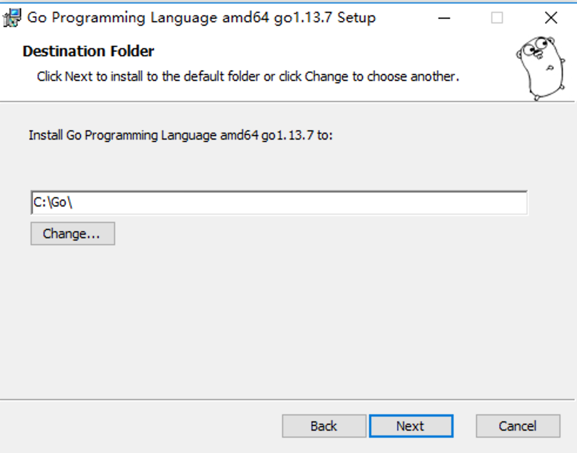
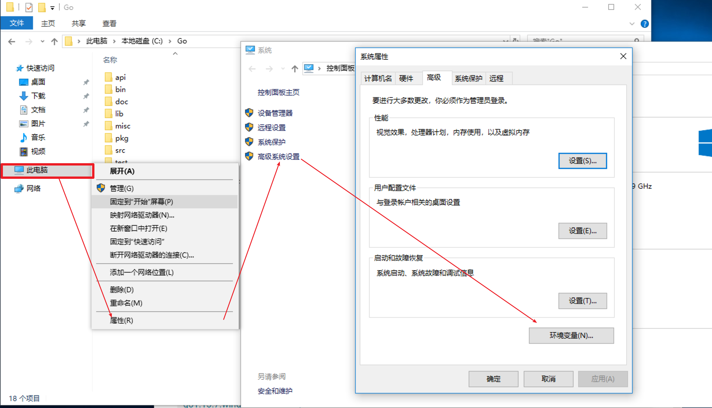
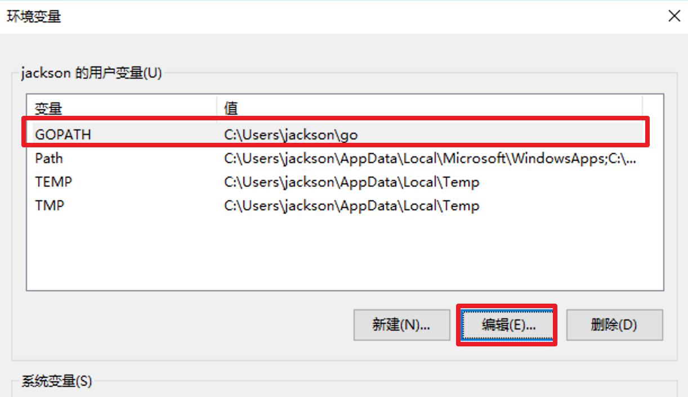

# golang快速入门[2.1]-go语言开发环境配置-windows
* 接下来，我们将讲解在windows、linux、macos三大平台上配置go语言的开发环境。

## windows安装Go语言开发包
* 配置go语言的开发环境的第一步是要在[go官网下载页面](https://golang.google.cn/dl/)
* windows需要下载msi后缀文件，msi是windows下的安装包文件格式,用于安装，存储和删除程序
<br/>

* 这里我们下载的是 64 位的开发包，如果读者的电脑是 32 位系统或者有特殊的需求，则需要下载 32 位的开发包
* 在上图所示页面中向下滚动即可找到 32 位开发包的下载地址，如下图所示
<br/>

* 双击我们下载好的Go语言开发包即可启动安装程序，如下图所示，这是Go语言的用户许可协议，无需管它，直接勾选“I accept ...”然后点击“Next”即可。
<br/>

* 在 Windows 系统下Go语言开发包会默认安装到 C 盘的 Go 目录下，推荐在这个目录下安装，使用起来较为方便。当然，你也可以选择其他的安装目录，确认无误后点击“Next”，如下图所示：
<br/>

* Go语言开发包的安装没有其他需要设置的选项，点击“Install”即可开始安装，如下图所示：
<br/>

* 等待程序完成安装，然后点击“Finish”退出安装程序。
<br/>

* 安装完成后，在我们所设置的安装目录下将生成一些目录和文件，如下图所示：
<br/>


这个目录的结构遵守 GOPATH 规则，后面的章节会提到这个概念。目录中各个文件夹的含义如下表所示。

| 目录名 | 说明                                                                  |
|--------|-----------------------------------------------------------------------|
| api    | 每个版本的 api 变更差异                                               |
| bin    | go 源码包编译出的编译器（go）、文档工具（godoc）、格式化工具（gofmt） |
| doc    | 英文版的 Go 文档                                                      |
| lib    | 引用的一些库文件                                                      |
| misc   | 杂项用途的文件，例如 Android 平台的编译、git 的提交钩子等             |
| pkg    | Windows 平台编译好的中间文件                                          |
| src    | 标准库的源码                                                          |
| test   | 测试用例                                                              |

## 设置环境变量
* 开发包安装完成后，我们还需要配置一下GOPATH 环境变量，之后才可以使用Go语言进行开发。GOPATH 是一个路径，他是go开发的工作空间,用来存放开发中需要用到的代码包。
* 在桌面或者资源管理器右键“此电脑”（或者“我的电脑”）→“属性”→“高级系统设置”→“环境变量”，如下图所示。
<br/>

* 在弹出的菜单里找到 GOPATH 对应的选项点击编辑之后就可以修改了，没有的话可以选择新建，并将变量名填写为 GOPATH，变量值设置为任意目录均可（尽量选择空目录），例如 D:\Go。
<br/>

* 提示：填写完成后，每个打开的窗口都需要点击“确定”来保存设置。
* 其它的环境变量安装包均会进行自动设置。
* 环境变量设置好后，可以通过在命令行输入go env 命令来进行测试。
```
C:\Windows\system32> go env
set GO111MODULE=
set GOARCH=amd64
set GOBIN=
set GOCACHE=C:\Users\jackson\AppData\Local\go-build
set GOENV=C:\Users\jackson\AppData\Roaming\go\env
set GOEXE=.exe
set GOFLAGS=
set GOHOSTARCH=amd64
set GOHOSTOS=windows
set GONOPROXY=
set GONOSUMDB=
set GOOS=windows
set GOPATH=C:\Users\jackson\go
set GOPRIVATE=
set GOPROXY=https://proxy.golang.org,direct
set GOROOT=c:\go
...
```
