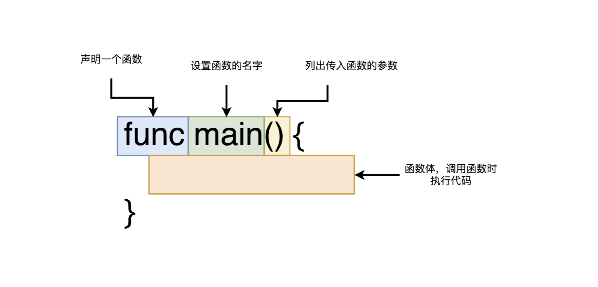
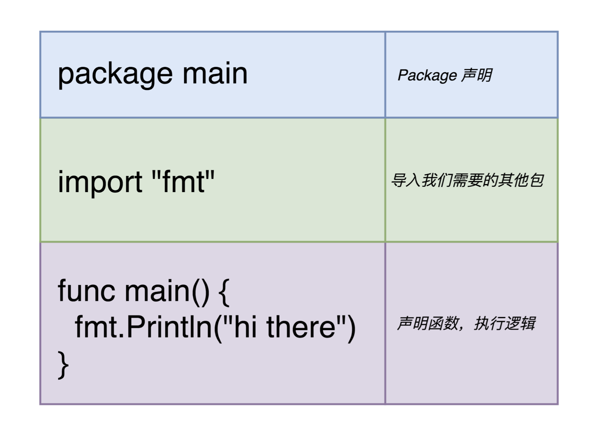

# golang快速入门[3]-go语言helloworld
* 在之前,我们介绍了如何在windows、macos以及linux平台构建go语言的开发环境
    + [golang快速入门[2.1]-go语言开发环境配置-windows](https://zhuanlan.zhihu.com/p/105462515)
    + [golang快速入门[2.2]-go语言开发环境配置-macOS](https://zhuanlan.zhihu.com/p/105551487)
    + [golang快速入门[2.3]-go语言开发环境配置-linux](https://zhuanlan.zhihu.com/p/105556890)
* 本文将介绍如何书写、编译、并运行第一个go语言程序
* 同时详细介绍其内部机制

## 书写第一个go语言程序
* 首先我们可以在任意位置新建一个文件,命名为`main.go`
* go源文件以.go作为后缀，命名时建议统一为小写英文字母
* 用任意的文本编辑器（vim,notepade,emacs...）编辑文件,书写如下代码
```
package main
import "fmt"
func main() {
	fmt.Println("Hello, world")
}
```
* 第一行 `package main`: package是一个关键字（也叫做"包"），声明为main的一个package
* 每一个go语言的源文件都需要以package开头
* package == 工程 == 工作空间
* 可以将package理解为一个工程，或者是一个工作空间
* 多个文件可以声明同一个package,但是必须在同一个文件夹中
* 声明同一个package，代表在package中的代码实现相似或者特定的功能
* package有两种类型，一种是声明为main的package，此package可以产生可以执行的文件。
* 其他名字的package不能产生可以执行的文件，其作为一种依赖包，有特定的功能，可以重复使用（例如数学计算）


* 第二行`import "fmt"` 代表程序导入了外部叫做fmt的package
* 这里的fmt是go语言标准库中的代码，go语言内置了种类繁多的标准库。参见：[golang标准库文档](https://golang.org/pkg/)
* fmt是重要的标准库，内置了许多输入输出功能，更可以用来进行代码调试
* go语言标准库中的代码存储于GOROOT环境变量中,


* 第三行func main 定义了一个名字为main的函数，函数是对于执行代码的封装



* 因此，下面对整段代码做一个总结



## go代码的编译与运行
* go是一门编译型语言
* 在命令行下，`cd`进入代码所在的路径
* 在命令行下编译代码有两种方式，运行`go run main.go` 或者`go build main.go`,二者的区别如下图所示
* `go run main.go` 不仅会编译并且会自动运行程序
* `go build main.go` 仅仅会编译代码生成main.exe(windows下是以.exe为后缀的可执行文件，而在mac或者linux下午后缀名)
* 执行`main.exe` 在命令行输出：`Hello, world`


## 总结
在本文中，我们详细介绍了如何书写、编译并运行第一个go语言helloworld程序，并详细说明了每一行的意义