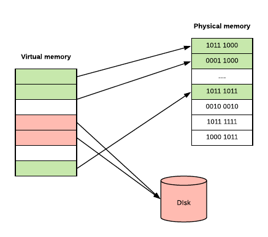
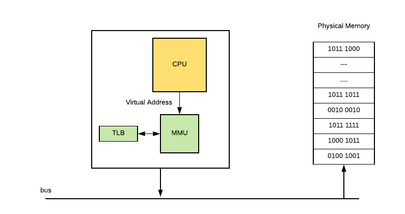
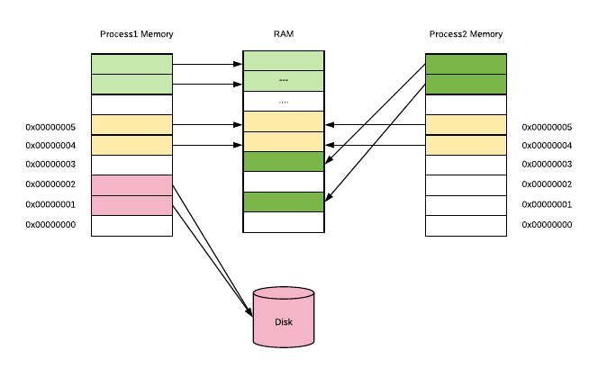

# golang快速入门[5.2]-go语言是如何运行的-内存概述

## 前文
* [golang快速入门[2.1]-go语言开发环境配置-windows](https://zhuanlan.zhihu.com/p/105462515)
* [golang快速入门[2.2]-go语言开发环境配置-macOS](https://zhuanlan.zhihu.com/p/105551487)
* [golang快速入门[2.3]-go语言开发环境配置-linux](https://zhuanlan.zhihu.com/p/105556890)
* [golang快速入门[3]-go语言helloworld](https://zhuanlan.zhihu.com/p/105776462)
* [golang快速入门[4]-go语言如何编译为机器码](https://zhuanlan.zhihu.com/p/106128892)
* [golang快速入门[5.1]-go语言是如何运行的-链接器](https://zhuanlan.zhihu.com/p/107495939)

## 前言
* 总的来说一个程序的生命周期可以概括为: 编写代码 => 编译 => 链接 => 加载到内存 => 执行
* 在上一篇文章中,我们详细介绍了go语言编译链接的过程
* 在本文中，我们将对内存进行简单介绍
* 在下文中，我们将介绍内存分配以及go语言中的内存分配

## 内存
* 在计算机中，术语"内存"又叫做主存，通常指的是可寻址的半导体存储器(硅基MOS晶体管组成的集成电路)
* 内存有易失性(volatile)和非易失性两种，非易失性内存主要用于存储特殊的程序（例如BIOS），易失性内存通常指的是随机存储器（random-access memory,RAM）
* RAM是计算机数据存储的一种形式，用于存储当前正在使用的数据和机器码
* RAM允许在几乎相同的时间内读取或写入数据项，而不管数据在内存中的位置
* 我们可以将物理内存视为如下的插槽/单元阵列，一个插槽可容纳`8位`的信息。每个内存插槽都有一个地址，CPU可以通过寻址读取或者写入特定地址的数据

* 计算机通常运行多个任务，直接操作物理内存将是非常危险的（例如某程序读取所有数据、或者A程序修改了B程序在内存中的数据）
* 因此，为了不直接操作物理内存，出现了虚拟内存的技术。通过虚拟内存，间接的操作物理内存

## 虚拟内存


* 拥有虚拟内存之后，程序运行时，它只会访问自己接触过的内存。同时，并非所有的数据都需要存储在RAM中。操作系统可以通过将一部分空闲的RAM置换到速度较慢的存储设备（例如磁盘）中,从而节省宝贵的RAM,获得更大的内存空间
* 可以根据CPU架构和操作系统绝对虚拟内存的实现细节，但是大部分采用的是分页表（Paged Virtual Memory）的形式来实现。在分页虚拟内存中，我们将虚拟内存分割为称为`页`的块
* 页的大小可能会因硬件而异，但通常为4-64 KB，通常可以使用2 MB至1 GB的大页。划分块很有用，避免了使用更多的内存来单独管理每个内存插槽，从而提升计算机的性能
* 为了实现分页虚拟内存，有一种称为内存管理单元（MMU）的芯片，它位于CPU和物理内存之间，MMU将虚拟内存地址到物理内存地址的映射保存在称为`页表(page table)`的表中（该表存储在内存中），每页包含一个“页表项”（Page Table Entry,PTE）.MMU还有叫做Translation Lookaside Buffer (TLB)的物理缓存，用于存储从虚拟内存到物理内存的最新转换



假设操作系统将一部分虚拟内存页放入了磁盘中，程序尝试访问它，则程序会发生以下过程：
* 1、CPU发出访问虚拟地址的命令，MMU在页面表中检查该地址后禁止访问，因为尚未为该虚拟页面分配物理RAM
* 2、然后，MMU将`页错误`发送到CPU
* 3、然后，操作系统通过查找RAM的备用存储块（称为frame）并设置新的PTE进行映射来处理Page错误
* 4、如果没有可用的RAM，则可以使用某种替换算法将现有页面保存到磁盘（此过程称为页面调度（paging））

* 操作系统通常管理多个应用程序（进程），因此整个内存管理如下：

* 每个进程都有一个线性虚拟地址空间，地址从0到某个最大值。虚拟地址空间不必是连续的，因此并非所有这些虚拟地址都实际用于存储数据，也不会占用RAM或磁盘中的空间
* 虚拟内存强大之处在于，同一块物理内存可以对应于多个进程的多个虚拟内存页

## 程序加载
* 在上面，我们概述了什么是内存以及如何实现硬件和操作系统相互通信
* 为了运行程序，操作系统具有一个模块，用于加载程序和所需的库，称为程序加载器。在Linux中，您可以使用`execve()`系统调用从程序中调用程序加载器
* 加载程序运行时，将通过以下步骤
    + 验证程序（权限，内存要求等）
    + 将程序从磁盘复制到主存储器
    + 传递命令行参数
    + 初始化寄存器（如栈指针）
* 加载完成后，操作系统通过将控制权传递给加载的程序代码来启动程序（执行跳转指令到程序的入口点）
* 在之前文章，我们介绍了`go build` 编译可以生成可执行文件和不可执行的obj文件。这些文件通常都拥有通用的格式，例如在linux中为ELF(Executable and Linkable Format)格式文件，在windows中为PE（Portable Executable）格式文件
* 有时，无法用Go编写所有内容。在这种情况下，一种选择是手工制作自己的ELF二进制文件并将机器代码放入正确的ELF结构中。obj文件包含多个部分 `.text` (可执行代码), `.data` (全局变量), and `.rodata` (全局常量)
* 在Go中，我们可以轻松地编写一个程序来读取ELF可执行文件，因为Go在标准库中有一个debug/elf包.如下例所示：

```
package main

import (
	"debug/elf"
	"log"
)

func main() {
	f, err := elf.Open("main")

	if err != nil {
		log.Fatal(err)
	}

	for _, section := range f.Sections {
		log.Println(section)
	}
}
```
* 输出如下

```
2020/02/18 20:54:16 &{{ SHT_NULL 0x0 0 0 0 0 0 0 0 0} 0xc00006e390 0xc00006e390 0 0}
2020/02/18 20:54:16 &{{.text SHT_PROGBITS SHF_ALLOC+SHF_EXECINSTR 4198400 4096 715732 0 0 16 0 715732} 0xc00006e3c0 0xc00006e3c0 0 0}
2020/02/18 20:54:16 &{{.rodata SHT_PROGBITS SHF_ALLOC 4915200 720896 389824 0 0 32 0 389824} 0xc00006e3f0 0xc00006e3f0 0 0}
2020/02/18 20:54:16 &{{.shstrtab SHT_STRTAB 0x0 0 1110720 417 0 0 1 0 417} 0xc00006e420 0xc00006e420 0 0}
2020/02/18 20:54:16 &{{.typelink SHT_PROGBITS SHF_ALLOC 5305472 1111168 3784 0 0 32 0 3784} 0xc00006e450 0xc00006e450 0 0}
2020/02/18 20:54:16 &{{.itablink SHT_PROGBITS SHF_ALLOC 5309256 1114952 248 0 0 8 0 248} 0xc00006e480 0xc00006e480 0 0}
2020/02/18 20:54:16 &{{.gosymtab SHT_PROGBITS SHF_ALLOC 5309504 1115200 0 0 0 1 0 0} 0xc00006e4b0 0xc00006e4b0 0 0}
2020/02/18 20:54:16 &{{.gopclntab SHT_PROGBITS SHF_ALLOC 5309504 1115200 527028 0 0 32 0 527028} 0xc00006e4e0 0xc00006e4e0 0 0}
2020/02/18 20:54:16 &{{.go.buildinfo SHT_PROGBITS SHF_WRITE+SHF_ALLOC 5836800 1642496 32 0 0 16 0 32} 0xc00006e510 0xc00006e510 0 0}
2020/02/18 20:54:16 &{{.noptrdata SHT_PROGBITS SHF_WRITE+SHF_ALLOC 5836832 1642528 55000 0 0 32 0 55000} 0xc00006e540 0xc00006e540 0 0}
2020/02/18 20:54:16 &{{.data SHT_PROGBITS SHF_WRITE+SHF_ALLOC 5891840 1697536 36464 0 0 32 0 36464} 0xc00006e570 0xc00006e570 0 0}
2020/02/18 20:54:16 &{{.bss SHT_NOBITS SHF_WRITE+SHF_ALLOC 5928320 1734016 115376 0 0 32 0 115376} 0xc00006e5a0 0xc00006e5a0 0 0}
2020/02/18 20:54:16 &{{.noptrbss SHT_NOBITS SHF_WRITE+SHF_ALLOC 6043712 1849408 10152 0 0 32 0 10152} 0xc00006e5d0 0xc00006e5d0 0 0}
2020/02/18 20:54:16 &{{.zdebug_abbrev SHT_PROGBITS 0x0 6053888 1736704 281 0 0 8 0 281} 0xc00006e600 0xc00006e600 0 0}
2020/02/18 20:54:16 &{{.zdebug_line SHT_PROGBITS 0x0 6054169 1736985 107844 0 0 8 0 107844} 0xc00006e630 0xc00006e630 0 0}
2020/02/18 20:54:16 &{{.zdebug_frame SHT_PROGBITS 0x0 6162013 1844829 29529 0 0 8 0 29529} 0xc0000b6000 0xc0000b6000 0 0}
2020/02/18 20:54:16 &{{.zdebug_pubnames SHT_PROGBITS 0x0 6191542 1874358 5947 0 0 8 0 5947} 0xc0000b6030 0xc0000b6030 0 0}
2020/02/18 20:54:16 &{{.zdebug_pubtypes SHT_PROGBITS 0x0 6197489 1880305 15217 0 0 8 0 15217} 0xc00006e660 0xc00006e660 0 0}
2020/02/18 20:54:16 &{{.debug_gdb_scripts SHT_PROGBITS 0x0 6212706 1895522 42 0 0 1 0 42} 0xc0000b6060 0xc0000b6060 0 0}
2020/02/18 20:54:16 &{{.zdebug_info SHT_PROGBITS 0x0 6212748 1895564 234437 0 0 8 0 234437} 0xc0000b6090 0xc0000b6090 0 0}
2020/02/18 20:54:16 &{{.zdebug_loc SHT_PROGBITS 0x0 6447185 2130001 108898 0 0 8 0 108898} 0xc00006e690 0xc00006e690 0 0}
2020/02/18 20:54:16 &{{.zdebug_ranges SHT_PROGBITS 0x0 6556083 2238899 38294 0 0 8 0 38294} 0xc0000b60c0 0xc0000b60c0 0 0}
2020/02/18 20:54:16 &{{.note.go.buildid SHT_NOTE SHF_ALLOC 4198300 3996 100 0 0 4 0 100} 0xc0000b60f0 0xc0000b60f0 0 0}
2020/02/18 20:54:16 &{{.symtab SHT_SYMTAB 0x0 0 2277376 75168 24 118 8 24 75168} 0xc0000b6120 0xc0000b6120 0 0}
2020/02/18 20:54:16 &{{.strtab SHT_STRTAB 0x0 0 2352544 80179 0 0 1 0 80179} 0xc00006e6c0 0xc00006e6c0 0 0}
```

* 可以使用Linux工具查看ELF文件，例如`size --format=sysv main` 或者 `readelf -l main `
* 如上所示，可执行文件只是具有某种预定义格式的文件。通常，可执行格式拥有许多段（segements），这些段是在运行程序之前映射的数据存储块。通常认为，程序具有如下格式


* text段包含程序的指令，文字和静态常量
* data段数据段通常是指用来存放程序中已初始化且不为0的全局变量的一块内存区域，它可以由exec预分配和预加载，并且进程可以扩展或收缩它
* stack段包含一个程序栈。它随着栈的增长而增长，但是不会随着栈的收缩而收缩
* 堆区通常从.bss和.data段的末尾开始，并从那里开始增长到更大的地址

## 总结
* 在本文中，我们简单的介绍了内存、虚拟内存、程序的一些基本概述
* 在下文中，我们将介绍内存分配以及go语言中的内存分配

## 参考资料
* [项目链接](https://github.com/dreamerjackson/theWayToGolang)
* [作者知乎](https://www.zhihu.com/people/ke-ai-de-xiao-tu-ji-71)
* [blog](https://dreamerjonson.com/)