# golang快速入门[5.3]-go语言是如何运行的-内存分配

## 前文
* [golang快速入门[2.1]-go语言开发环境配置-windows](https://zhuanlan.zhihu.com/p/107659334)
* [golang快速入门[2.2]-go语言开发环境配置-macOS](https://zhuanlan.zhihu.com/p/107661202)
* [golang快速入门[2.3]-go语言开发环境配置-linux](https://zhuanlan.zhihu.com/p/107662649)
* [golang快速入门[3]-go语言helloworld](https://zhuanlan.zhihu.com/p/107664129)
* [golang快速入门[4]-go语言如何编译为机器码](https://zhuanlan.zhihu.com/p/107665043)
* [golang快速入门[5.1]-go语言是如何运行的-链接器](https://zhuanlan.zhihu.com/p/107665658)
* [golang快速入门[5.2]-go语言是如何运行的-内存概述](https://zhuanlan.zhihu.com/p/107807229)

## 前言
* 在之前的文章中,我们对go语言的基本原理做了阐述,本章将介绍go语言的集成开发环境。
* 对于一个成熟的开发人员来说，致力于用最便捷高效的开发工具来加速书写、调试go程序。集成开发环境（Integrated Development Environment，简称IDE）是一种辅助程序开发人员开发软件的应用软件，在开发工具内部就可以辅助编写源代码文本、并编译打包成为可用的程序，有些甚至可以设计图形接口。IDE通常包括编程语言编辑器、自动构建工具、通常还包括调试器。
* 大部分的集成开发环境都针对一种特点的语言,goland是JetBrains开发的一款针对go语言的跨平台IDE。支持windows、macOS与Ubuntu平台。 因为专注，所以专业,goland为go程序提供了强大的支持。

## 挑选集成开发环境考虑的元素
* 语法高亮是必不可少的功能，这也是为什么每个开发工具都提供配置文件来实现自定义配置的原因。
* 拥有较好的项目文件纵览和导航能力，可以同时编辑多个源文件并设置书签，能够匹配括号，能够跳转到某个函数或类型的定义部分。
* 完美的查找和替换功能，替换之前最好还能预览结果。
* 当有编译错误时，双击错误提示可以跳转到发生错误的位置。
* 跨平台，能够在 Linux、Mac OS X 和 Windows 下工作，这样就可以专注于一个开发环境。
* 能够通过插件架构来轻易扩展和替换某个功能。
* 拥有断点、检查变量值、单步执行、逐过程执行标识库中代码的能力。
* 能够方便的存取最近使用过的文件或项目。
* 拥有对包、类型、变量、函数和方法的智能代码补全的功能。
* 能够方便地在不同的 Go 环境之间切换。
* 针对一些特定的项目有项目模板，如：Web 应用，App Engine 项目，从而能够更快地开始开发工作

## 安装goland
* goland支持windows、macOS与Ubuntu平台,下面我们以windows平台为例为大家介绍安装`goland 2019.3`，其他平台安装类似
* 首先进入[goland官网](https://github.com/dreamerjackson/theWayToGolang)，点击下载,安装最新版goland

* 点击下一步
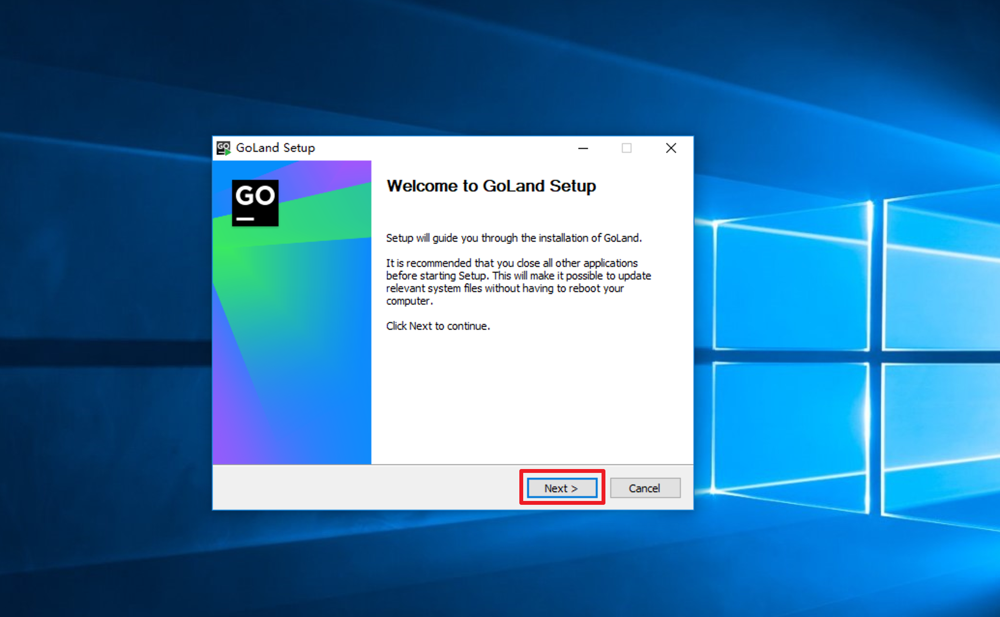
* 择安装路径、默认即可，选择下一步
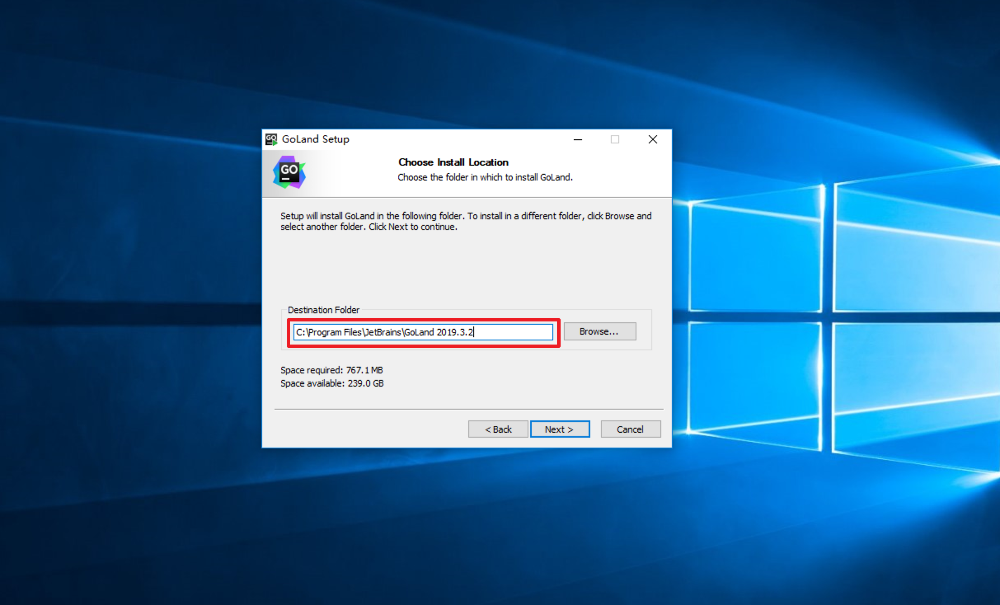
* 安装配置选项,勾选添加桌面图标以及与`.go`文件关联即可

* 选择开始菜单文件夹,默认即可，点击`insall` 进行安装
* 安装完成后，点击`finish`,运行goland


## 第一次打开goland
* 在一开始打开goland时,由于没有任何已有配置，我们选择`don't import settings`
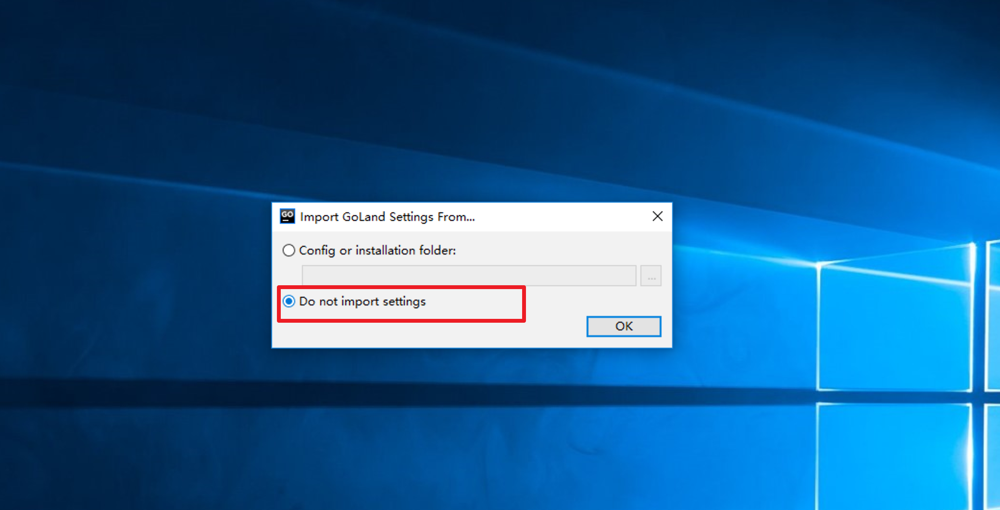
* 确认接受同意协议，你懂的~
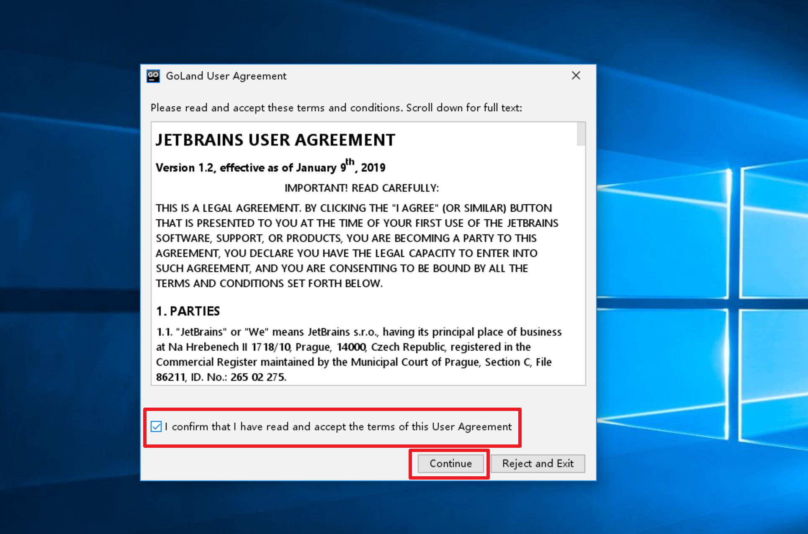
* 发送反馈，选择`don't send`
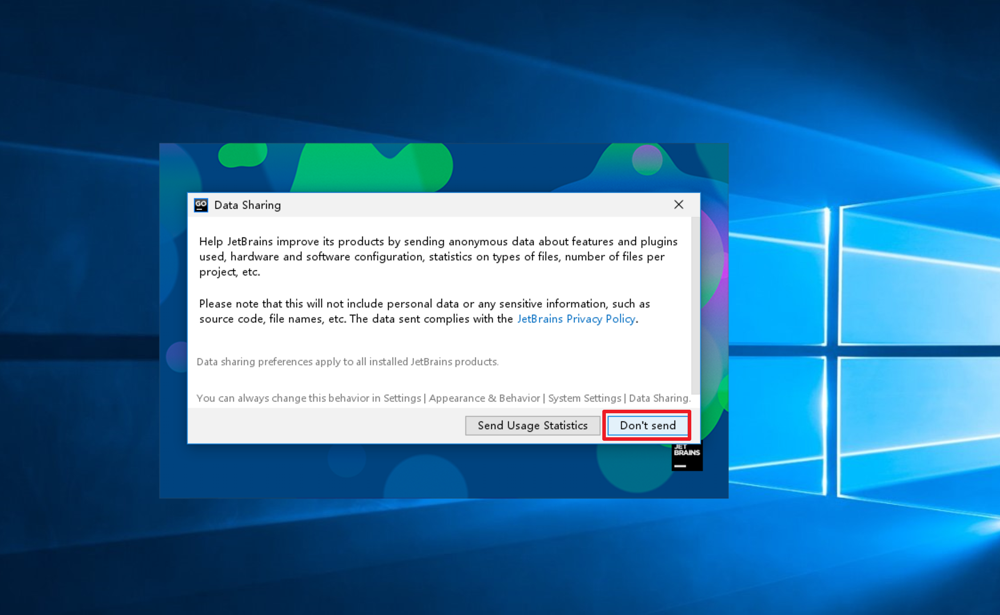
* 选择UI背景,程序员一般选择黑色，眼神不好可以选择白色，跳过其他设置

## goland的激活
* 任何用户可以免费获取30天的试用
* 第一种是方式土豪:goland的激活目前有多种方式，直接会到[官网](https://www.jetbrains.com/go/buy/#commercial?billing=yearly)进行购买，199美元一年
* 第二种方式：对于学生可以免费申请。[申请地址](https://www.jetbrains.com/zh-cn/student/)
* 第三种方式：安装破解版goland、这种方式不是很好，因为无法享受更新
* 第四种方式：特殊渠道如淘宝购买，只需要几块钱
* 第五种方式：后台留言获取激活码~

## 第一次使用
* 选择新建一个项目
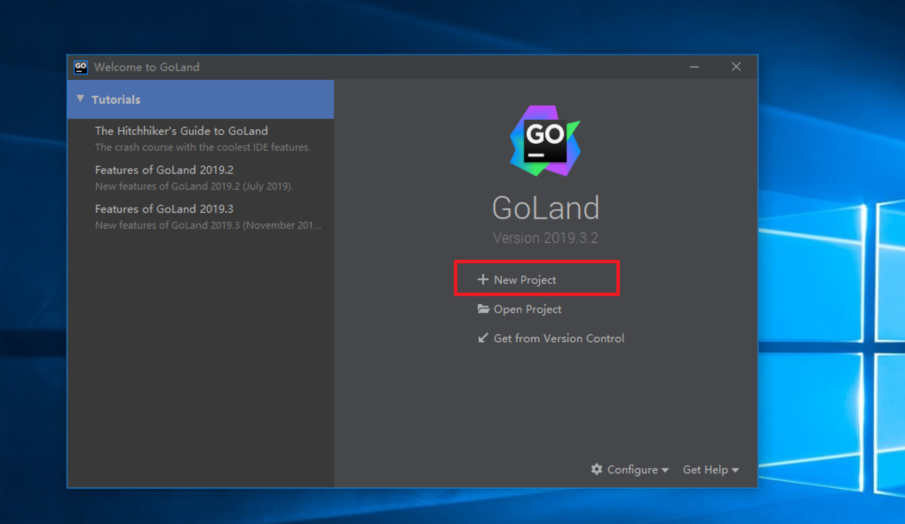
* 修改项目名，点击创建
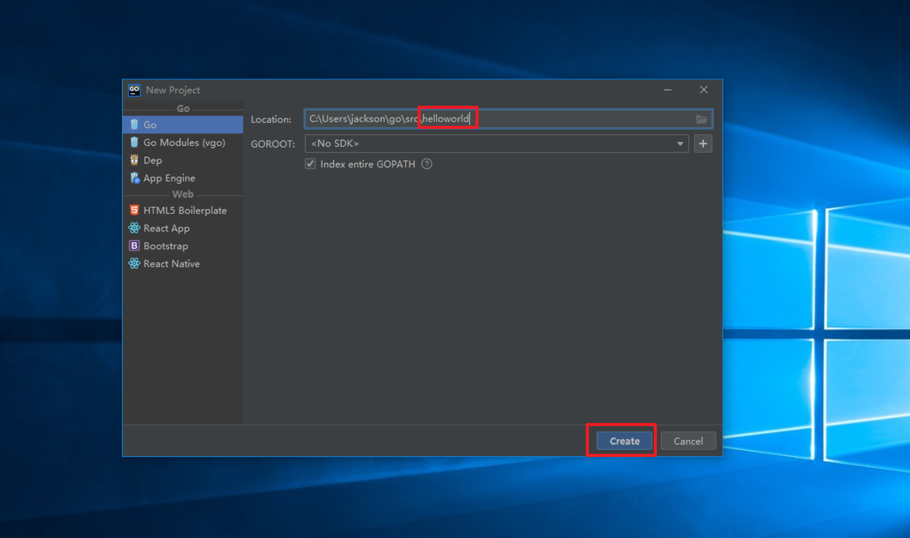
* 点击文件夹，右键，创建一个main.go文件
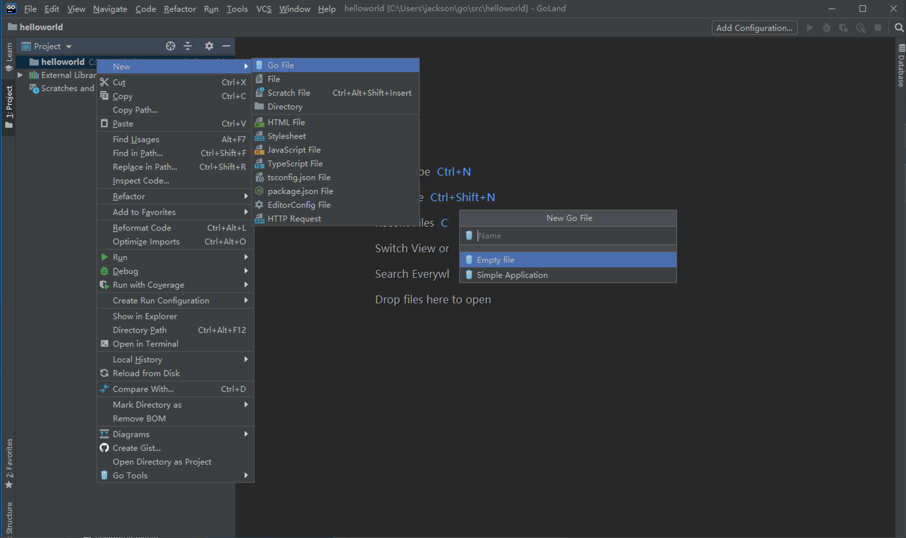

## goland 整体视图
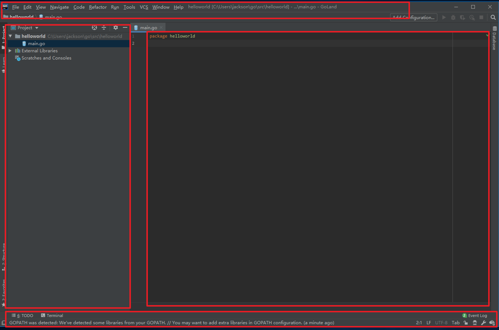
* 如上图，最上方为工具栏，可以修改,创建,搜索,删除,替换，修改视图,跳转,运行,调试等多种功能
* 最左边为项目的目录树结构、依赖等
* 右边为编辑代码的地方
* 最下边也有各种`终端`，`todo`工具栏，以及状态栏

## goland 配置
* goland配置可以点击最上方"file->setiing",一开始配置得最多的是`goroot`,`gopath`,`字体大小与颜色`
* `goroot`、`gopath`、`gomodule`等概念后面笔者会详细介绍，goland默认会使用环境变量中的`goroot`与`gopath`路径
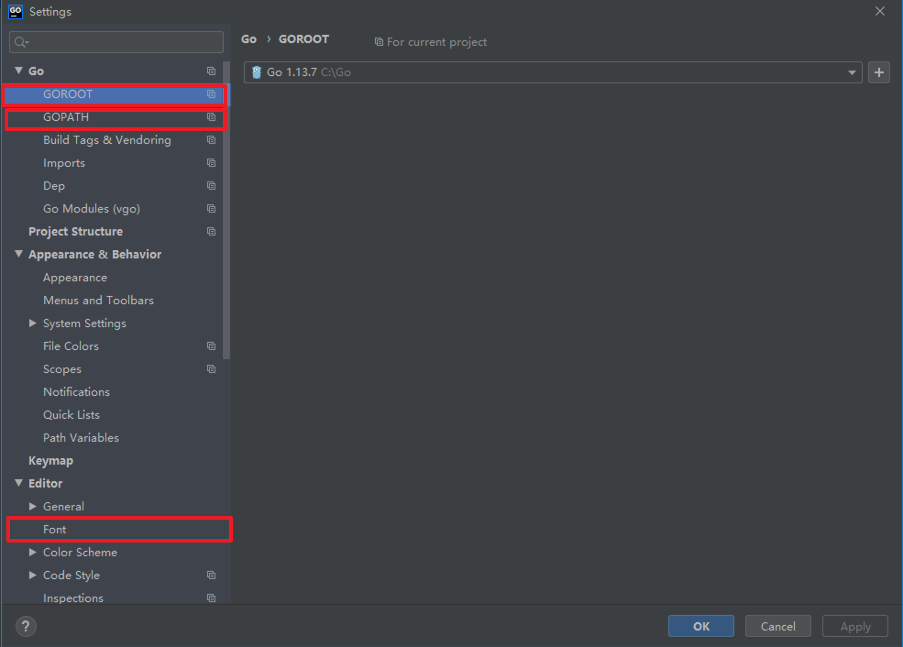
* 还有很多对数据库的支持，git的集成工具等，在本文中暂时不做介绍

## goland 书写第一个helloworld程序
* 当我们书写一个最简单的helloworld程序时，当我们输入`fmt.`，会看到goland会智能的显示出fmt包中的函数。当完成函数编写时，会自动的导入fmt包，`import "fmt"`这是goland强大功能的一个体现。
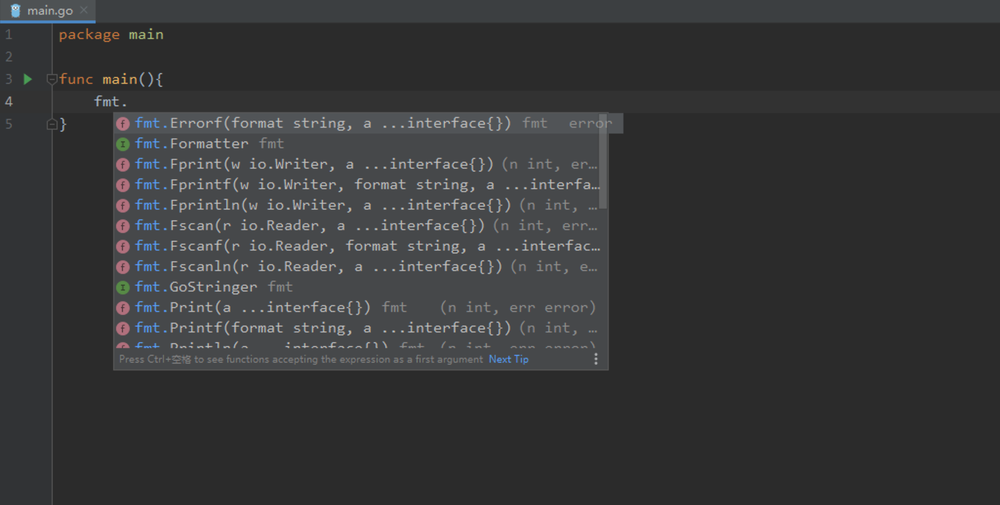
* 当代码写好之后，运行代码有多种方式
    + 第一种,点击上方选项卡`Run -> Run`
    + 第二种，使用快捷键，mac下为`shift + option + R`，windows下为`Alt + shift + F10`
    + 第三种，点击`func main()` 左边的绿色箭头
    + 第四种，在最下方到终端中，书写`go run main.go` 并运行

## goland 快捷键
* goland拥有很多快捷键，可以加速我们对于代码的书写.下面我们介绍goland分别在`windows`/`ubuntu` 与`mac`下的快捷键使用
* goland中要查看、修改、查找所有的快捷键，可以在顶部工具栏`file-> keymap`查看
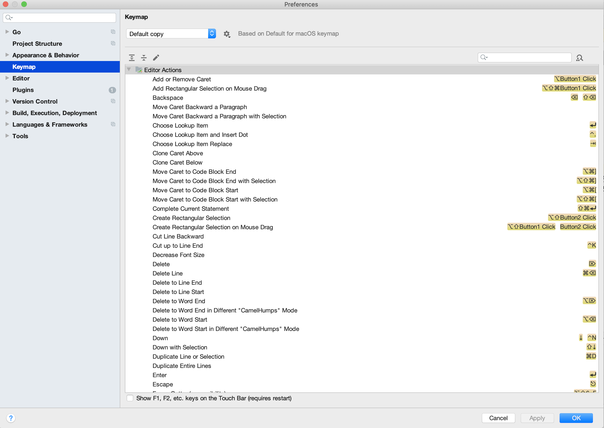
* 在使用快捷键的时候，要注意快捷键冲突的问题，例如与搜狗输入法等软件的快捷键冲突
##  mac下快捷键
#### Mac 键盘符号和修饰键说明
```
⌘ ——> Command
⇧ ——> Shift
⌥ ——> Option
⌃ ——> Control
↩︎ ——> Return/Enter
⌫ ——> Delete
⌦ ——> 向前删除键(Fn + Delete)
↑ ——> 上箭头
↓ ——> 下箭头
← ——> 左箭头
→ ——> 右箭头
⇞ ——> Page Up(Fn + ↑)
⇟ ——> Page Down(Fn + ↓)
⇥ ——> 右制表符(Tab键)
⇤ ——> 左制表符(Shift + Tab)
⎋ ——> Escape(Esc)
End ——> Fn + →
Home ——> Fn + ←
```
#### Part 1：Editing（编辑）
快捷键	作用


| 快捷键 | 作用 |
|-------------------------------------------|---------------------------------------------------------------------------|
| Control + Space | 基本的代码补全（补全任何类、方法、变量） |
| Control + Shift + Space | 智能代码补全（过滤器方法列表和变量的预期类型） |
| Command + Shift + Enter | 自动结束代码，行末自动添加分号 |
| Command + P | 显示方法的参数信息 |
| Control + J | 快速查看文档 |
| Shift + F1 | 查看外部文档（在某些代码上会触发打开浏览器显示相关文档） |
| Command + 鼠标放在代码上 | 显示代码简要信息 |
| Command + F1 | 在错误或警告处显示具体描述信息 |
| Command + N, Control + Enter, Control + N | 生成代码（getter、setter、hashCode、equals、toString、构造函数等） |
| Control + O | 覆盖方法（重写父类方法） |
| Control + I | 实现方法（实现接口中的方法） |
| Command + Option + T | 包围代码（使用if...else、try...catch、for、synchronized等包围选中的代码） |
| Command + / | 注释 / 取消注释与行注释 |
| Command + Option + / | 注释 / 取消注释与块注释 |
| Option + 方向键上 | 连续选中代码块 |
| Option + 方向键下 | 减少当前选中的代码块 |
| Control + Shift + Q | 显示上下文信息 |
| Option + Enter | 显示意向动作和快速修复代码 |
| Command + Option + L | 格式化代码 |
| Control + Option + O | 优化 import |
| Control + Option + I | 自动缩进线 |
| Tab / Shift + Tab | 缩进代码 / 反缩进代码 |
| Command + X | 剪切当前行或选定的块到剪贴板 |
| Command + C | 复制当前行或选定的块到剪贴板 |
| Command + V | 从剪贴板粘贴 |
| Command + Shift + V | 从最近的缓冲区粘贴 |
| Command + D | 复制当前行或选定的块 |
| Command + Delete | 删除当前行或选定的块的行 |
| Control + Shift + J | 智能的将代码拼接成一行 |
| Command + Enter | 智能的拆分拼接的行 |
| Shift + Enter | 开始新的一行 |
| Command + Shift + U | 大小写切换 |
| Command + Shift + ] / Command + Shift + [ | 选择直到代码块结束 / 开始 |
| Option + Fn + Delete | 删除到单词的末尾 |
| Option + Delete | 删除到单词的开头 |
| Command + 加号 / Command + 减号 | 展开 / 折叠代码块 |
| Command + Shift + 加号 | 展开所以代码块 |
| Command + Shift + 减号 | 折叠所有代码块 |
| Command + W | 关闭活动的编辑器选项卡 |
#### Part 2：Search / Replace（查询/替换）
| 快捷键 | 作用 |
|---------------------|-----------------------------------------------------------|
| Double Shift | 查询任何东西 |
| Command + F | 文件内查找 |
| Command + G | 查找模式下，向下查找 |
| Command + Shift + G | 查找模式下，向上查找 |
| Command + R | 文件内替换 |
| Command + Shift + F | 全局查找（根据路径） |
| Command + Shift + R | 全局替换（根据路径） |
| Command + Shift + S | 查询结构（Ultimate Edition 版专用，需要在 Keymap 中设置） |
| Command + Shift + M | 替换结构（Ultimate Edition 版专用，需要在 Keymap 中设置） |
#### Part 3：Usage Search（使用查询）
| 快捷键 | 作用 |
|----------------------------|-----------------------------------|
| Option + F7 / Command + F7 | 在文件中查找用法 / 在类中查找用法 |
| Command + Shift + F7 | 在文件中突出显示的用法 |
| Command + Option + F7 | 显示用法 |
#### Part 4：Compile and Run（编译和运行）
| 快捷键 | 作用 |
|------------------------------------------|----------------------------|
| Command + F9 | 编译 Project |
| Command + Shift + F9 | 编译选择的文件、包或模块 |
| Control + Option + R | 弹出 Run 的可选择菜单 |
| Control + Option + D | 弹出 Debug 的可选择菜单 |
| Control + R | 运行 |
| Control + D | 调试 |
| Control + Shift + R, Control + Shift + D | 从编辑器运行上下文环境配置 |
#### Part 5：Debugging（调试）
| 快捷键 | 作用 |
|----------------------|----------------------------------------------------------------------------------------------------------|
| F8 | 进入下一步，如果当前行断点是一个方法，则不进入当前方法体内 |
| F7 | 进入下一步，如果当前行断点是一个方法，则进入当前方法体内，如果该方法体还有方法，则不会进入该内嵌的方法中 |
| Shift + F7 | 智能步入，断点所在行上有多个方法调用，会弹出进入哪个方法 |
| Shift + F8 | 跳出 |
| Option + F9 | 运行到光标处，如果光标前有其他断点会进入到该断点 |
| Option + F8 | 计算表达式（可以更改变量值使其生效） |
| Command + Option + R | 恢复程序运行，如果该断点下面代码还有断点则停在下一个断点上 |
| Command + F8 | 切换断点（若光标当前行有断点则取消断点，没有则加上断点） |
| Command + Shift + F8 | 查看断点信息 |
#### Part 6：Navigation（导航）
| 快捷键 | 作用 |
|-----------------------------------------------------------|---------------------------------------------------------------------------------------------------------|
| Command + O | 查找类文件 |
| Command + Shift + O | 查找所有类型文件、打开文件、打开目录，打开目录需要在输入的内容前面或后面加一个反斜杠/ |
| Command + Option + O | 前往指定的变量 / 方法 |
| Control + 方向键左 / Control + 方向键右 | 左右切换打开的编辑 tab 页 |
| F12 | 返回到前一个工具窗口 |
| Esc | 从工具窗口进入代码文件窗口 |
| Shift + Esc | 隐藏当前或最后一个活动的窗口，且光标进入代码文件窗口 |
| Command + Shift + F4 | 关闭活动 run/messages/find/... tab |
| Command + L | 在当前文件跳转到某一行的指定处 |
| Command + E | 显示最近打开的文件记录列表 |
| Option + 方向键左 / Option + 方向键右 | 光标跳转到当前单词 / 中文句的左 / 右侧开头位置 |
| Command + Option + 方向键左 / Command + Option + 方向键右 | 退回 / 前进到上一个操作的地方 |
| Command + Shift + Delete | 跳转到最后一个编辑的地方 |
| Option + F1 | 显示当前文件选择目标弹出层，弹出层中有很多目标可以进行选择(如在代码编辑窗口可以选择显示该文件的 Finder) |
| Command + B / Command + 鼠标点击 | 进入光标所在的方法/变量的接口或是定义处 |
| Command + Option + B | 跳转到实现处，在某个调用的方法名上使用会跳到具体的实现处，可以跳过接口 |
| Option + Space, Command + Y | 快速打开光标所在方法、类的定义 |
| Control + Shift + B | 跳转到类型声明处 |
| Command + U | 前往当前光标所在方法的父类的方法 / 接口定义 |
| Control + 方向键下 / Control + 方向键上 | 当前光标跳转到当前文件的前一个 / 后一个方法名位置 |
| Command + ] / Command + [ | 移动光标到当前所在代码的花括号开始 / 结束位置 |
| Command + F12 | 弹出当前文件结构层，可以在弹出的层上直接输入进行筛选（可用于搜索类中的方法） |
| Control + H | 显示当前类的层次结构 |
| Command + Shift + H | 显示方法层次结构 |
| Control + Option + H | 显示调用层次结构 |
| F2 / Shift + F2 | 跳转到下一个 / 上一个突出错误或警告的位置 |
| F4 / Command + 方向键下 | 编辑 / 查看代码源 |
| Option + Home | 显示到当前文件的导航条 |
| F3 | 选中文件 / 文件夹 / 代码行，添加 / 取消书签 |
| Option + F3 | 选中文件 / 文件夹/代码行，使用助记符添加 / 取消书签 |
| Control + 0…Control + 9 | 定位到对应数值的书签位置 |
| Command + F3 | 显示所有书签 |
| 快捷键 | 作用 |
|----------------------|------------------------------------|
| F5 | 复制文件到指定目录 |
| F6 | 移动文件到指定目录 |
| Command + Delete | 在文件上为安全删除文件，弹出确认框 |
| Shift + F6 | 重命名文件 |
| Command + F6 | 更改签名 |
| Command + Option + N | 一致性 |
| Command + Option + M | 将选中的代码提取为方法 |
| Command + Option + V | 提取变量 |
| Command + Option + F | 提取字段 |
| Command + Option + C | 提取常量 |
| Command + Option + P | 提取参数 |
#### Part 8：VCS / Local History（版本控制 / 本地历史记录）
| 快捷键 | 作用 |
|--------------------|----------------------------|
| Command + K | 提交代码到版本控制器 |
| Command + T | 从版本控制器更新代码 |
| Option + Shift + C | 查看最近的变更记录 |
| Control + C | 快速弹出版本控制器操作面板 |
#### Part 9：Live Templates（动态代码模板）
| 快捷键 | 作用 |
|----------------------|------------------------------------------------|
| Command + Option + J | 弹出模板选择窗口，将选定的代码使用动态模板包住 |
| Command + J | 插入自定义动态代码模板 |
#### Part 10：General（通用）
| 快捷键 | 作用 |
|-------------------------|---------------------------------------------------------------------------------------|
| Command + 1…Command + 9 | 打开相应编号的工具窗口 |
| Command + S | 保存所有 |
| Command + Option + Y | 同步、刷新 |
| Control + Command + F | 切换全屏模式 |
| Command + Shift + F12 | 切换最大化编辑器 |
| Option + Shift + F | 添加到收藏夹 |
| Option + Shift + I | 检查当前文件与当前的配置文件 |
| Control + ` | 快速切换当前的 scheme（切换主题、代码样式等） |
| Command + , | 打开 IDEA 系统设置 |
| Command + ; | 打开项目结构对话框 |
| Shift + Command + A | 查找动作（可设置相关选项） |
| Control + Shift + Tab | 编辑窗口标签和工具窗口之间切换（如果在切换的过程加按上 delete，则是关闭对应选中的窗口 |
## windows下快捷键
#### Ctrl

|快捷键|介绍|
|:---------|:---------|
|<kbd>Ctrl</kbd> + <kbd>F</kbd>|在当前文件进行文本查找 `（必备）` |
|<kbd>Ctrl</kbd> + <kbd>R</kdb>|在当前文件进行文本替换 `（必备）` |
|<kbd>Ctrl</kbd> + <kbd>Z</kdb>|撤销 `（必备）` |
|<kbd>Ctrl</kbd> + <kbd>Y</kdb>|删除光标所在行 或 删除选中的行 `（必备）` |
|<kbd>Ctrl</kbd> + <kbd>X</kdb>|剪切光标所在行 或 剪切选择内容|
|<kbd>Ctrl</kbd> + <kbd>C</kdb>|复制光标所在行 或 复制选择内容|
|<kbd>Ctrl</kbd> + <kbd>D</kdb>|复制光标所在行 或 复制选择内容，并把复制内容插入光标位置下面 `（必备）` |
|<kbd>Ctrl</kbd> + <kbd>W</kdb>|递进式选择代码块。可选中光标所在的单词或段落，连续按会在原有选中的基础上再扩展选中范围 `（必备）` |
|<kbd>Ctrl</kbd> + <kbd>E</kdb>|显示最近打开的文件记录列表 `（必备）` |
|<kbd>Ctrl</kbd> + <kbd>N</kdb>|根据输入的 **类名** 查找类文件 `（必备）` |
|<kbd>Ctrl</kbd> + <kbd>G</kdb>|在当前文件跳转到指定行处|
|<kbd>Ctrl</kbd> + <kbd>J</kdb>|插入自定义动态代码模板 `（必备）` |
|<kbd>Ctrl</kbd> + <kbd>P</kdb>|方法参数提示显示 `（必备）` |
|<kbd>Ctrl</kbd> + <kbd>Q</kdb>|光标所在的变量 / 类名 / 方法名等上面（也可以在提示补充的时候按），显示文档内容|
|<kbd>Ctrl</kbd> + <kbd>U</kdb>|前往当前光标所在的方法的父类的方法 / 接口定义 `（必备）` |
|<kbd>Ctrl</kbd> + <kbd>B</kdb>|进入光标所在的方法/变量的接口或是定义处，等效于 `Ctrl + 左键单击`  `（必备）` |
|<kbd>Ctrl</kbd> + <kbd>K</kdb>|版本控制提交项目，需要此项目有加入到版本控制才可用|
|<kbd>Ctrl</kbd> + <kbd>T</kdb>|版本控制更新项目，需要此项目有加入到版本控制才可用|
|<kbd>Ctrl</kbd> + <kbd>H</kdb>|显示当前类的层次结构|
|<kbd>Ctrl</kbd> + <kbd>O</kdb>|选择可重写的方法|
|<kbd>Ctrl</kbd> + <kbd>I</kdb>|选择可继承的方法|
|<kbd>Ctrl</kbd> + <kbd>\+</kdb>|展开代码|
|<kbd>Ctrl</kbd> + <kbd>\-</kdb>|折叠代码|
|<kbd>Ctrl</kbd> + <kbd>/</kdb>|注释光标所在行代码，会根据当前不同文件类型使用不同的注释符号 `（必备）` |
|<kbd>Ctrl</kbd> + <kbd>\[</kdb>|移动光标到当前所在代码的花括号开始位置|
|<kbd>Ctrl</kbd> + <kbd>\]</kdb>|移动光标到当前所在代码的花括号结束位置|
|<kbd>Ctrl</kbd> + <kbd>F1</kdb>|在光标所在的错误代码处显示错误信息 `（必备）` |
|<kbd>Ctrl</kbd> + <kbd>F3</kdb>|调转到所选中的词的下一个引用位置 `（必备）` |
|<kbd>Ctrl</kbd> + <kbd>F4</kdb>|关闭当前编辑文件|
|<kbd>Ctrl</kbd> + <kbd>F8</kdb>|在 Debug 模式下，设置光标当前行为断点，如果当前已经是断点则去掉断点|
|<kbd>Ctrl</kbd> + <kbd>F9</kdb>|执行 Make Project 操作|
|<kbd>Ctrl</kbd> + <kbd>F11</kdb>|选中文件 / 文件夹，使用助记符设定 / 取消书签 `（必备）` |
|<kbd>Ctrl</kbd> + <kbd>F12</kdb>|弹出当前文件结构层，可以在弹出的层上直接输入，进行筛选|
|<kbd>Ctrl</kbd> + <kbd>Tab</kdb>|编辑窗口切换，如果在切换的过程又加按上delete，则是关闭对应选中的窗口|
|<kbd>Ctrl</kbd> + <kbd>End</kdb>|跳到文件尾|
|<kbd>Ctrl</kbd> + <kbd>Home</kdb>|跳到文件头|
|<kbd>Ctrl</kbd> + <kbd>Space</kdb>|基础代码补全，默认在 Windows 系统上被输入法占用，需要进行修改，建议修改为 `Ctrl + 逗号` `（必备）` |
|<kbd>Ctrl</kbd> + <kbd>Delete</kdb>|删除光标后面的单词或是中文句 `（必备）` |
|<kbd>Ctrl</kbd> + <kbd>BackSpace</kdb>|删除光标前面的单词或是中文句 `（必备）` |
|<kbd>Ctrl</kbd> + <kbd>1,2,3...9</kdb>|定位到对应数值的书签位置 `（必备）` |
|<kbd>Ctrl</kbd> + <kbd>左键单击</kdb>|在打开的文件标题上，弹出该文件路径 `（必备）` |
|<kbd>Ctrl</kbd> + <kbd>光标定位</kdb>|按 Ctrl 不要松开，会显示光标所在的类信息摘要|
|<kbd>Ctrl</kbd> + <kbd>左方向键</kdb>|光标跳转到当前单词 / 中文句的左侧开头位置 `（必备）` |
|<kbd>Ctrl</kbd> + <kbd>右方向键</kdb>|光标跳转到当前单词 / 中文句的右侧开头位置 `（必备）` |
|<kbd>Ctrl</kbd> + <kbd>前方向键</kdb>|等效于鼠标滚轮向前效果 `（必备）` |
|<kbd>Ctrl</kbd> + <kbd>后方向键</kdb>|等效于鼠标滚轮向后效果 `（必备）` |

#### Alt

|快捷键|介绍|
|:---------|:---------|
|<kbd>Alt</kbd> + <kbd>\`</kbd>|显示版本控制常用操作菜单弹出层 `（必备）` |
|<kbd>Alt</kbd> + <kbd>Q</kbd>|弹出一个提示，显示当前类的声明 / 上下文信息|
|<kbd>Alt</kbd> + <kbd>F1</kbd>|显示当前文件选择目标弹出层，弹出层中有很多目标可以进行选择 `（必备）` |
|<kbd>Alt</kbd> + <kbd>F2</kbd>|对于前面页面，显示各类浏览器打开目标选择弹出层|
|<kbd>Alt</kbd> + <kbd>F3</kbd>|选中文本，逐个往下查找相同文本，并高亮显示|
|<kbd>Alt</kbd> + <kbd>F7</kbd>|查找光标所在的方法 / 变量 / 类被调用的地方|
|<kbd>Alt</kbd> + <kbd>F8</kbd>|在 Debug 的状态下，选中对象，弹出可输入计算表达式调试框，查看该输入内容的调试结果|
|<kbd>Alt</kbd> + <kbd>Home</kbd>|定位 / 显示到当前文件的 `Navigation Bar` |
|<kbd>Alt</kbd> + <kbd>Enter</kbd>|IntelliJ IDEA 根据光标所在问题，提供快速修复选择，光标放在的位置不同提示的结果也不同 `（必备）` |
|<kbd>Alt</kbd> + <kbd>Insert</kbd>|代码自动生成，如生成对象的 set / get 方法，构造函数，toString() 等 `（必备）` |
|<kbd>Alt</kbd> + <kbd>左方向键</kbd>|切换当前已打开的窗口中的子视图，比如Debug窗口中有Output、Debugger等子视图，用此快捷键就可以在子视图中切换 `（必备）` |
|<kbd>Alt</kbd> + <kbd>右方向键</kbd>|按切换当前已打开的窗口中的子视图，比如Debug窗口中有Output、Debugger等子视图，用此快捷键就可以在子视图中切换 `（必备）` |
|<kbd>Alt</kbd> + <kbd>前方向键</kbd>|当前光标跳转到当前文件的前一个方法名位置 `（必备）` |
|<kbd>Alt</kbd> + <kbd>后方向键</kbd>|当前光标跳转到当前文件的后一个方法名位置 `（必备）` |
|<kbd>Alt</kbd> + <kbd>1,2,3...9</kbd>|显示对应数值的选项卡，其中 1 是 Project 用得最多 `（必备）` |

#### Shift

|快捷键|介绍|
|:---------|:---------|
|<kbd>Shift</kbd> + <kbd>F1</kbd>|如果有外部文档可以连接外部文档|
|<kbd>Shift</kbd> + <kbd>F2</kbd>|跳转到上一个高亮错误 或 警告位置|
|<kbd>Shift</kbd> + <kbd>F3</kbd>|在查找模式下，查找匹配上一个|
|<kbd>Shift</kbd> + <kbd>F4</kbd>|对当前打开的文件，使用新Windows窗口打开，旧窗口保留|
|<kbd>Shift</kbd> + <kbd>F6</kbd>|对文件 / 文件夹 重命名|
|<kbd>Shift</kbd> + <kbd>F7</kbd>|在 Debug 模式下，智能步入。断点所在行上有多个方法调用，会弹出进入哪个方法|
|<kbd>Shift</kbd> + <kbd>F8</kbd>|在 Debug 模式下，跳出，表现出来的效果跟 `F9` 一样|
|<kbd>Shift</kbd> + <kbd>F9</kbd>|等效于点击工具栏的 `Debug` 按钮|
|<kbd>Shift</kbd> + <kbd>F10</kbd>|等效于点击工具栏的 `Run` 按钮|
|<kbd>Shift</kbd> + <kbd>F11</kbd>|弹出书签显示层 `（必备）` |
|<kbd>Shift</kbd> + <kbd>Tab</kbd>|取消缩进 `（必备）` |
|<kbd>Shift</kbd> + <kbd>ESC</kbd>|隐藏当前 或 最后一个激活的工具窗口|
|<kbd>Shift</kbd> + <kbd>End</kbd>|选中光标到当前行尾位置|
|<kbd>Shift</kbd> + <kbd>Home</kbd>|选中光标到当前行头位置|
|<kbd>Shift</kbd> + <kbd>Enter</kbd>|开始新一行。光标所在行下空出一行，光标定位到新行位置 `（必备）` |
|<kbd>Shift</kbd> + <kbd>左键单击</kbd>|在打开的文件名上按此快捷键，可以关闭当前打开文件 `（必备）` |
|<kbd>Shift</kbd> + <kbd>滚轮前后滚动</kbd>|当前文件的横向滚动轴滚动 `（必备）` |

#### Ctrl + Alt

|快捷键|介绍|
|:---------|:---------|
|<kbd>Ctrl</kbd> + <kbd>Alt</kbd> + <kbd>L</kbd>|格式化代码，可以对当前文件和整个包目录使用 `（必备）` |
|<kbd>Ctrl</kbd> + <kbd>Alt</kbd> + <kbd>O</kbd>|优化导入的类，可以对当前文件和整个包目录使用 `（必备）` |
|<kbd>Ctrl</kbd> + <kbd>Alt</kbd> + <kbd>I</kbd>|光标所在行 或 选中部分进行自动代码缩进，有点类似格式化|
|<kbd>Ctrl</kbd> + <kbd>Alt</kbd> + <kbd>T</kbd>|对选中的代码弹出环绕选项弹出层 `（必备）` |
|<kbd>Ctrl</kbd> + <kbd>Alt</kbd> + <kbd>J</kbd>|弹出模板选择窗口，将选定的代码加入动态模板中|
|<kbd>Ctrl</kbd> + <kbd>Alt</kbd> + <kbd>H</kbd>|调用层次|
|<kbd>Ctrl</kbd> + <kbd>Alt</kbd> + <kbd>B</kbd>|在某个调用的方法名上使用会跳到具体的实现处，可以跳过接口|
|<kbd>Ctrl</kbd> + <kbd>Alt</kbd> + <kbd>C</kbd>|重构-快速提取常量|
|<kbd>Ctrl</kbd> + <kbd>Alt</kbd> + <kbd>F</kbd>|重构-快速提取成员变量|
|<kbd>Ctrl</kbd> + <kbd>Alt</kbd> + <kbd>V</kbd>|重构-快速提取变量|
|<kbd>Ctrl</kbd> + <kbd>Alt</kbd> + <kbd>Y</kbd>|同步、刷新|
|<kbd>Ctrl</kbd> + <kbd>Alt</kbd> + <kbd>S</kbd>|打开 IntelliJ IDEA 系统设置 `（必备）` |
|<kbd>Ctrl</kbd> + <kbd>Alt</kbd> + <kbd>F7</kbd>|显示使用的地方。寻找被该类或是变量被调用的地方，用弹出框的方式找出来|
|<kbd>Ctrl</kbd> + <kbd>Alt</kbd> + <kbd>F11</kbd>|切换全屏模式|
|<kbd>Ctrl</kbd> + <kbd>Alt</kbd> + <kbd>Enter</kbd>|光标所在行上空出一行，光标定位到新行 `（必备）` |
|<kbd>Ctrl</kbd> + <kbd>Alt</kbd> + <kbd>Home</kbd>|弹出跟当前文件有关联的文件弹出层|
|<kbd>Ctrl</kbd> + <kbd>Alt</kbd> + <kbd>Space</kbd>|类名自动完成|
|<kbd>Ctrl</kbd> + <kbd>Alt</kbd> + <kbd>左方向键</kbd>|退回到上一个操作的地方 `（必备）` |
|<kbd>Ctrl</kbd> + <kbd>Alt</kbd> + <kbd>右方向键</kbd>|前进到上一个操作的地方 `（必备）` |
|<kbd>Ctrl</kbd> + <kbd>Alt</kbd> + <kbd>前方向键</kbd>|在查找模式下，跳到上个查找的文件|
|<kbd>Ctrl</kbd> + <kbd>Alt</kbd> + <kbd>后方向键</kbd>|在查找模式下，跳到下个查找的文件|
|<kbd>Ctrl</kbd> + <kbd>Alt</kbd> + <kbd>右括号（]）</kbd>|在打开多个项目的情况下，切换下一个项目窗口|
|<kbd>Ctrl</kbd> + <kbd>Alt</kbd> + <kbd>左括号（[）</kbd>|在打开多个项目的情况下，切换上一个项目窗口|


#### Ctrl + Shift

|快捷键|介绍|
|:---------|:---------|
|<kbd>Ctrl</kbd> + <kbd>Shift</kbd> + <kbd>F</kbd>|根据输入内容查找整个项目 或 指定目录内文件 `（必备）` |
|<kbd>Ctrl</kbd> + <kbd>Shift</kbd> + <kbd>R</kbd>|根据输入内容替换对应内容，范围为整个项目 或 指定目录内文件 `（必备）` |
|<kbd>Ctrl</kbd> + <kbd>Shift</kbd> + <kbd>J</kbd>|自动将下一行合并到当前行末尾 `（必备）` |
|<kbd>Ctrl</kbd> + <kbd>Shift</kbd> + <kbd>Z</kbd>|取消撤销 `（必备）` |
|<kbd>Ctrl</kbd> + <kbd>Shift</kbd> + <kbd>W</kbd>|递进式取消选择代码块。可选中光标所在的单词或段落，连续按会在原有选中的基础上再扩展取消选中范围 `（必备）` |
|<kbd>Ctrl</kbd> + <kbd>Shift</kbd> + <kbd>N</kbd>|通过文件名定位 / 打开文件 / 目录，打开目录需要在输入的内容后面多加一个正斜杠 `（必备）` |
|<kbd>Ctrl</kbd> + <kbd>Shift</kbd> + <kbd>U</kbd>|对选中的代码进行大 / 小写轮流转换 `（必备）` |
|<kbd>Ctrl</kbd> + <kbd>Shift</kbd> + <kbd>T</kbd>|对当前类生成单元测试类，如果已经存在的单元测试类则可以进行选择 `（必备）` |
|<kbd>Ctrl</kbd> + <kbd>Shift</kbd> + <kbd>C</kbd>|复制当前文件磁盘路径到剪贴板 `（必备）` |
|<kbd>Ctrl</kbd> + <kbd>Shift</kbd> + <kbd>V</kbd>|弹出缓存的最近拷贝的内容管理器弹出层|
|<kbd>Ctrl</kbd> + <kbd>Shift</kbd> + <kbd>E</kbd>|显示最近修改的文件列表的弹出层|
|<kbd>Ctrl</kbd> + <kbd>Shift</kbd> + <kbd>H</kbd>|显示方法层次结构|
|<kbd>Ctrl</kbd> + <kbd>Shift</kbd> + <kbd>B</kbd>|跳转到类型声明处 `（必备）` |
|<kbd>Ctrl</kbd> + <kbd>Shift</kbd> + <kbd>I</kbd>|快速查看光标所在的方法 或 类的定义|
|<kbd>Ctrl</kbd> + <kbd>Shift</kbd> + <kbd>A</kbd>|查找动作 / 设置|
|<kbd>Ctrl</kbd> + <kbd>Shift</kbd> + <kbd>/</kbd>|代码块注释 `（必备）` |
|<kbd>Ctrl</kbd> + <kbd>Shift</kbd> + <kbd>\[</kbd>|选中从光标所在位置到它的顶部中括号位置 `（必备）` |
|<kbd>Ctrl</kbd> + <kbd>Shift</kbd> + <kbd>\]</kbd>|选中从光标所在位置到它的底部中括号位置 `（必备）` |
|<kbd>Ctrl</kbd> + <kbd>Shift</kbd> + <kbd>\+</kbd>|展开所有代码 `（必备）` |
|<kbd>Ctrl</kbd> + <kbd>Shift</kbd> + <kbd>\-</kbd>|折叠所有代码 `（必备）` |
|<kbd>Ctrl</kbd> + <kbd>Shift</kbd> + <kbd>F7</kbd>|高亮显示所有该选中文本，按Esc高亮消失 `（必备）` |
|<kbd>Ctrl</kbd> + <kbd>Shift</kbd> + <kbd>F8</kbd>|在 Debug 模式下，指定断点进入条件|
|<kbd>Ctrl</kbd> + <kbd>Shift</kbd> + <kbd>F9</kbd>|编译选中的文件 / 包 / Module|
|<kbd>Ctrl</kbd> + <kbd>Shift</kbd> + <kbd>F12</kbd>|编辑器最大化 `（必备）` |
|<kbd>Ctrl</kbd> + <kbd>Shift</kbd> + <kbd>Space</kbd>|智能代码提示|
|<kbd>Ctrl</kbd> + <kbd>Shift</kbd> + <kbd>Enter</kbd>|自动结束代码，行末自动添加分号 `（必备）` |
|<kbd>Ctrl</kbd> + <kbd>Shift</kbd> + <kbd>Backspace</kbd>|退回到上次修改的地方 `（必备）` |
|<kbd>Ctrl</kbd> + <kbd>Shift</kbd> + <kbd>1,2,3...9</kbd>|快速添加指定数值的书签 `（必备）` |
|<kbd>Ctrl</kbd> + <kbd>Shift</kbd> + <kbd>左键单击</kbd>|把光标放在某个类变量上，按此快捷键可以直接定位到该类中 `（必备）` |
|<kbd>Ctrl</kbd> + <kbd>Shift</kbd> + <kbd>左方向键</kbd>|在代码文件上，光标跳转到当前单词 / 中文句的左侧开头位置，同时选中该单词 / 中文句 `（必备）` |
|<kbd>Ctrl</kbd> + <kbd>Shift</kbd> + <kbd>右方向键</kbd>|在代码文件上，光标跳转到当前单词 / 中文句的右侧开头位置，同时选中该单词 / 中文句 `（必备）` |
|<kbd>Ctrl</kbd> + <kbd>Shift</kbd> + <kbd>前方向键</kbd>|光标放在方法名上，将方法移动到上一个方法前面，调整方法排序 `（必备）` |
|<kbd>Ctrl</kbd> + <kbd>Shift</kbd> + <kbd>后方向键</kbd>|光标放在方法名上，将方法移动到下一个方法前面，调整方法排序 `（必备）` |

#### Alt + Shift

|快捷键|介绍|
|:---------|:---------|
|<kbd>Alt</kbd> + <kbd>Shift</kbd> + <kbd>N</kbd>|选择 / 添加 task `（必备）` |
|<kbd>Alt</kbd> + <kbd>Shift</kbd> + <kbd>F</kbd>|显示添加到收藏夹弹出层 / 添加到收藏夹|
|<kbd>Alt</kbd> + <kbd>Shift</kbd> + <kbd>C</kbd>|查看最近操作项目的变化情况列表|
|<kbd>Alt</kbd> + <kbd>Shift</kbd> + <kbd>I</kbd>|查看项目当前文件|
|<kbd>Alt</kbd> + <kbd>Shift</kbd> + <kbd>F7</kbd>|在 Debug 模式下，下一步，进入当前方法体内，如果方法体还有方法，则会进入该内嵌的方法中，依此循环进入|
|<kbd>Alt</kbd> + <kbd>Shift</kbd> + <kbd>F9</kbd>|弹出 `Debug`  的可选择菜单|
|<kbd>Alt</kbd> + <kbd>Shift</kbd> + <kbd>F10</kbd>|弹出 `Run`  的可选择菜单|
|<kbd>Alt</kbd> + <kbd>Shift</kbd> + <kbd>左键双击</kbd>|选择被双击的单词 / 中文句，按住不放，可以同时选择其他单词 / 中文句 `（必备）` |
|<kbd>Alt</kbd> + <kbd>Shift</kbd> + <kbd>前方向键</kbd>|移动光标所在行向上移动 `（必备）` |
|<kbd>Alt</kbd> + <kbd>Shift</kbd> + <kbd>后方向键</kbd>|移动光标所在行向下移动 `（必备）` |

#### Ctrl + Shift + Alt

|快捷键|介绍|
|:---------|:---------|
|<kbd>Ctrl</kbd> + <kbd>Shift</kbd> + <kbd>Alt</kbd> + <kbd>V</kbd>|无格式黏贴 `（必备）` |
|<kbd>Ctrl</kbd> + <kbd>Shift</kbd> + <kbd>Alt</kbd> + <kbd>N</kbd>|前往指定的变量 / 方法|
|<kbd>Ctrl</kbd> + <kbd>Shift</kbd> + <kbd>Alt</kbd> + <kbd>S</kbd>|打开当前项目设置 `（必备）` |
|<kbd>Ctrl</kbd> + <kbd>Shift</kbd> + <kbd>Alt</kbd> + <kbd>C</kbd>|复制参考信息|

#### 其他

|快捷键|介绍|
|:---------|:---------|
|<kbd>F2</kbd>|跳转到下一个高亮错误 或 警告位置 `（必备）` |
|<kbd>F3</kbd>|在查找模式下，定位到下一个匹配处|
|<kbd>F4</kbd>|编辑源 `（必备）` |
|<kbd>F7</kbd>|在 Debug 模式下，进入下一步，如果当前行断点是一个方法，则进入当前方法体内，如果该方法体还有方法，则不会进入该内嵌的方法中|
|<kbd>F8</kbd>|在 Debug 模式下，进入下一步，如果当前行断点是一个方法，则不进入当前方法体内|
|<kbd>F9</kbd>|在 Debug 模式下，恢复程序运行，但是如果该断点下面代码还有断点则停在下一个断点上|
|<kbd>F11</kbd>|添加书签 `（必备）` |
|<kbd>F12</kbd>|回到前一个工具窗口 `（必备）` |
|<kbd>Tab</kbd>|缩进 `（必备）` |
|<kbd>ESC</kbd>|从工具窗口进入代码文件窗口 `（必备）` |
|<kbd>连按两次Shift</kbd>|弹出 `Search Everywhere` 弹出层|

## 总结
* 在本文中介绍了go语言集成开发环境goland的安装、配置、激活、以及基本的快捷键用法
* 在下文中，我们将介绍编辑器之神`emacs`中如何集成开发go代码

## 参考资料
* [项目链接](https://github.com/dreamerjackson/theWayToGolang)
* [作者知乎](https://www.zhihu.com/people/ke-ai-de-xiao-tu-ji-71)
* [blog](https://dreamerjonson.com/)
* [学生申请](https://www.jetbrains.com/zh-cn/student/)
* [官网快捷键资料 windows/ubuntu](https://www.jetbrains.com/idea/docs/IntelliJIDEA_ReferenceCard.pdf)
* [官网快捷键资料 mac](https://www.jetbrains.com/idea/docs/IntelliJIDEA_ReferenceCard_Mac.pdf)
* [keymap-introduce](https://github.com/judasn/IntelliJ-IDEA-Tutorial/blob/master/keymap-introduce.md)
