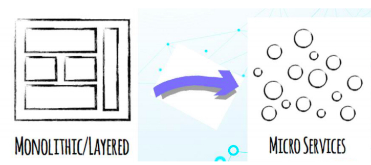
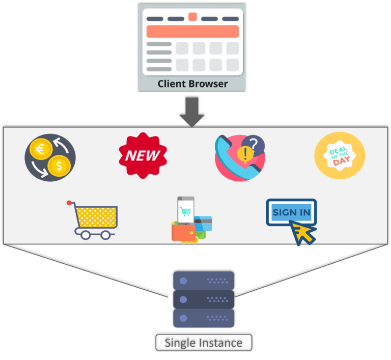
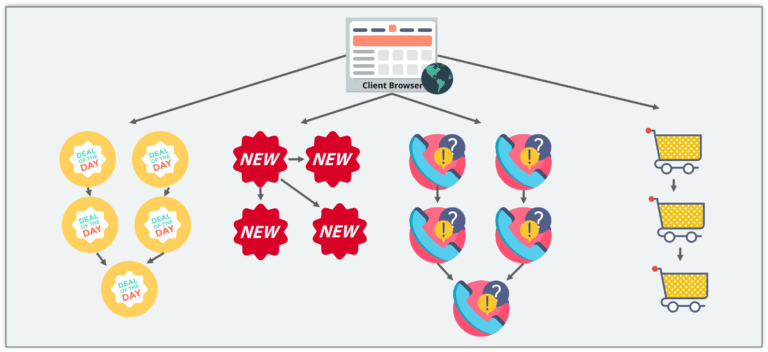
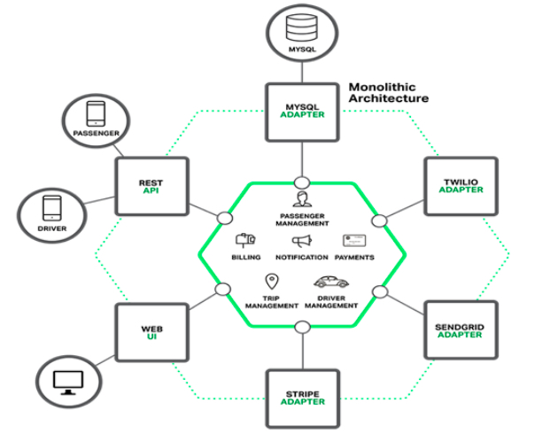
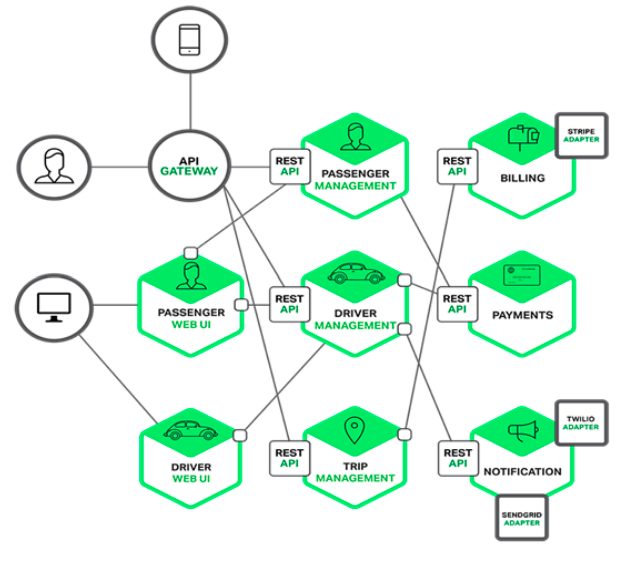

# 微服务理论与实践[1]-什么是微服务
## 什么是微服务

* 微服务 (Microservices) 是一种软件架构风格，将应用程序构造为围绕业务的小型自治服务的集合
* 微服务以专注于单一责任与功能的小型功能区块 (Small Building Blocks) 为基础。每个服务都是独立的，并实现单个业务功能
* 微服务利用模块化的方式组合出复杂的大型应用程序，各功能区块使用与语言无关的 API 集相互通信
* 微服务运用了以业务功能为主导的设计概念，应用程序在设计时就能先以业务功能或流程设计先行分割，将各个业务功能都独立实现成一个能自主运行的个体服务，然后再利用相同的协议将所有应用程序需要的服务都组合起来，形成一个应用程序

## 微服务例子1
* 以购物车应用程序为例，当打开购物车应用程序时，您看到的只是一个网站。但是，在后台，购物车应用程序具有用于接受付款服务，客户服务等
* 假设此应用程序的开发人员使用了单体框架，架构如下图:

* 如图，在单体架构中，所有功能都放在一个代码库中，并在一个基础数据库下。
* 现在，假设市场上出现了一个新品牌，并且开发人员希望将即将到来的品牌的所有详细信息放入此应用程序中
* 此时，不仅需要处理新品牌的服务，而且还必须重新构建整个系统并相应地进行部署。为了避免此类挑战，开发人员决定将其应用程序从单体架构转换为微服务

* 开发人员为搜索，推荐，客户服务等创建了单独的微服务。
* 此微服务架构不仅可以帮助开发人员克服以前的架构所面临的所有挑战，而且还可以轻松地构建，部署和扩展购物车应用程序。

## 微服务例子2
* 以旅游行业应用程序为例

* 整体服务包括了旅客关系管理、付款、消息通知等服务
* 传统的单体常常采用如上图所示的整体式架构，并采取MVC的设计模式
* 三层架构（MVC）的具体内容如下
  + 表示层（view）： 用户使用应用程序时，看到的、听见的、输入的或者交互的部分。
  + 业务逻辑层（controller）： 根据用户输入的信息，进行逻辑计算或者业务处理的部分。
  + 数据访问层（model）： 关注有效地操作原始数据的部分，如将数据存储到存储介质（如数据库、文件系统）及
  + 从存储介质中读取数据等。
* 虽然现在程序被分成了三层，但只是逻辑上的分层，并不是物理上的分层。也就是说，对不同层的代码而言，经过编译、打包和部署后，所有的代码最终还是运行在同一个进程中。
单体架构在规模比较小的情况下工作情况良好，但是随着系统规模的扩大，它暴露出来的问题也越来越多，主要有以下几点：
* 复杂性逐渐变高
  + 比如有的项目有几十万行代码，各个模块之间区别比较模糊，逻辑比较混乱，代码越多复杂性越高，越难解决遇到的问题。
*  技术债务逐渐上升
   + 公司的人员流动是再正常不过的事情，有的员工在离职之前，疏于代码质量的自我管束，导致留下来很多坑，由于单体项目代码量庞大的惊人，留下的坑很难被发觉，这就给新来的员工带来很大的烦恼，人员流动越大所留下的坑越多，也就是所谓的技术债务越来越多。
* 维护成本大
  + 当应用程序的功能越来越多、团队越来越大时，沟通成本、管理成本显著增加。当出现 bug 时，可能引起 bug 的原因组合越来越多，导致分析、定位和修复的成本增加；并且在对全局功能缺乏深度理解的情况下，容易在修复bug 时引入新的 bug。
* 持续交付周期长
  + 构建和部署时间会随着功能的增多而增加，任何细微的修改都会触发部署流水线。新人培养周期长：新成员了解背景、熟悉业务和配置环境的时间越来越长。
* 技术选型成本高
  + 单块架构倾向于采用统一的技术平台或方案来解决所有问题，如果后续想引入新的技术或框架，成本和风险都很大。
* 可扩展性差
  + 随着功能的增加，垂直扩展的成本将会越来越大；而对于水平扩展而言，因为所有代码都运行在同一个进程，没办法做到针对应用程序的部分功能做独立的扩展。

## 微服务架构

* 将上面的整体架构改造为如上图所示的微服务
* 来自不同设备的不同客户端尝试使用不同的服务，例如搜索，构建，配置和其他管理功能
* 所有服务均根据其功能进行分离，并进一步分离为单个微服务
* 这些微服务具有自己的负载均衡和执行环境以执行其功能,并在其自己的数据库中捕获数据
* 微服务之间通过无状态服务器(REST、GRPC或消息总线)进行通信
* 微服务借助服务发现来了解其通信路径并执行自动化，监控等操作功能
* 微服务执行的所有功能通过API网关传达给客户端

## 微服务特点
* 解耦
  + 系统中的服务在很大程度上是解耦的。因此，整个应用程序可以轻松构建，更改和扩展
* 组件化
  + 微服务被视为独立的组件，可以轻松替换和升级
* 专注业务功能
  + 业务功能–微服务非常简单，专注于单一功能
* 独立自主
  + 开发人员和团队可以彼此独立地工作，从而提高了速度
* 持续交付
  + 通过自动化的构建、测试和部署，允许频繁发布软件。
* 分散治理
  + 重点是使用正确的工具完成正确的工作。这意味着没有标准化模式或任何技术模式。开发人员可以自由选择最有用的工具来解决他们的问题
* 敏捷开发
  + 微服务支持敏捷开发。任何新功能都可以快速开发并丢弃

## 微服务的优点
* 单一职责
  + 微服务架构中的每个服务，都是具有业务逻辑的，符合高内聚、低耦合原则以及单一职责原则的单元，不同的服务通过“管道”的方式灵活组合，从而构建出庞大的系统。
* 轻量级通信
  + 服务之间通过轻量级的通信机制实现互通互联，而所谓的轻量级，通常指语言无关、平台无关的交互方式。
  + 对于轻量级通信的格式而言，我们熟悉的 XML 和 JSON，它们是语言无关、平台无关的；对于通信的协议而言，通常基于 HTTP，能让服务间的通信变得标准化、无状态化。目前大家熟悉的 REST（Representational StateTransfer）、GRPC是实现服务间互相协作的轻量级通信机制之一。使用轻量级通信机制，可以让团队选择更适合的语言、工具或者平台来开发服务本身。
* 提高容错性（fault isolation），一个服务的内存泄露并不会让整个系统瘫痪
* 独立性
  + 服务独立测试、部署、升级、发布
  + 在单块架构中所有功能都在同一个代码库，功能的开发不具有独立性；当不同小组完成多个功能后，需要经过集成和回归测试，测试过程也不具有独立性；当测试完成后，应用被构建成一个包，如果某个功能存在 bug，将导致整个部署失败或者回滚
* 新技术的应用，系统不会被长期限制在某个技术栈上
* 可以根据市场需求，灵活多变的组合出新的业务场景
* 降低代码耦合度
* 服务实例水平扩展，服务单一职责，功能独立。保证可靠性与性能，提升资源利用
  + 由于微服务是以业务功能导向的实现，因此不会受到应用程序的干扰，微服务的管理员可以视运算资源的需要来配置微服务到不同的运算资源内，或是布建新的运算资源并将它配置进去
* 提升开发交流，每个服务足够内聚，足够小，代码容易理解
*  进程隔离、故障隔离
   + 单块架构中，整个系统运行在同一个进程中，当应用进行部署时，必须停掉当前正在运行的应用，部署完成后再重启进程，无法做到独立部署。
有时候我们会将重复的代码抽取出来封装成组件，在单块架构中，组件通常的形态叫做共享库（如 jar 包或者DLL），但是当程序运行时，所有组件最终也会被加载到同一进程中运行。
    + 在微服务架构中，应用程序由多个服务组成，每个服务都是高度自治的独立业务实体，可以运行在独立的进程中，不同的服务能非常容易地部署到不同的主机上。
  + 即使应用程序的一项服务不起作用，系统仍然可以继续运行
* 数据分区，数据独立，可靠性保证

## 微服务的缺点
* 微服务提高了系统的复杂度
* 开发人员要处理分布式系统的复杂性
* 服务之间的分布式事务问题
* 服务的注册与发现问题
* 数据隔离再来的报表处理问题
* 不同服务实例的管理困难，持续自动化部署的要求
* 运维要求较高
  + 对于单体架构来讲，我们只需要维护好这一个项目就可以了，但是对于微服务架构来讲，由于项目是由多个微服务构成的，每个模块出现问题都会造成整个项目运行出现异常，想要知道是哪个模块造成的问题往往是不容易的，因为我们无法一步一步通过debug的方式来跟踪，这就对运维人员提出了很高的要求。
*  分布式的复杂性
  + 对于单体架构来讲，我们可以不使用分布式，但是对于微服务架构来说，分布式几乎是必会用的技术，由于分布式本身的复杂性，导致微服务架构也变得复杂起来。
* 接口调整成本高
  + 比如，用户微服务是要被订单微服务和电影微服务所调用的，一旦用户微服务的接口发生大的变动，那么所有依赖它的微服务都要做相应的调整，由于微服务可能非常多，那么调整接口所造成的成本将会明显提高。

## 微服务的沟通
### 沟通与事件广播
微服务的规划与单体式应用程序十分不同，微服务中每个服务都需要避免与其他服务有所牵连，且都要能够自主，并在其他服务发生错误时不受干扰。
倘若真有沟通，也应采用异步沟通的方式来避免紧密的相依性问题。要达到此目的，则可用下列两种方式：
* 事件存储中心（Event Store）
这可以让你在服务集群中广播事件，并且在每个服务中监听这些事件并作处理，这令服务之间没有紧密的相依性，而这些发生的事件都会被保存在事件存储中心里。这意味着当微服务重新上线、部署时可以重播（Replay）所有的事件。这也造就了微服务的数据库随时都可以被删除、摧毁，且不需要从其他服务中获取数据。

* 消息队列（Message Queue）
  + 能够在服务集群中广播消息，并传递到每个服务中
  + 比较有名的消息中间件如：NSQ、RabbitMQ、Nats、Kafka
  + A 服务上广播一个事件，此事件可以顺带一些数据。B 服务可以监听这个事件并在接收到之后有所处理。这些过程都是异步处理的
  + A 服务并不需要等到 B 服务处理完该事件后才能继续，而这也代表 A 服务无法获取 B 服务的处理结果
  + 与事件存储中心不同的是：消息队列并不会保存事件。一旦事件被消化（接收）后就会从队列中消失
### 服务发现
* 单个微服务在上线的时候，会向服务注册中心注册自己的 IP 位置、服务内容
* 当服务需要调用另一个服务的时候，会去询问服务探索中心该服务的 IP 位置，得到位置后即可直接向目标服务发起调用
* 这么做的用意是可以统一集中所有服务的位置，就不会分散于每个微服务中
* 服务探索中心可以每隔一段时间就向微服务进行健康检查（TCP 调用、HTTP 调用、Ping）
* 倘若该服务在时间内没有回应，则将其从服务中心移除，避免其他微服务对一个无回应的服务进行调用
* 即便微服务重新在其他ip上部署，其他服务也是无感知的
* 比较常用的服务发现有：etcd，consul，普遍都采用了raft等分布式算法

## 微服务其他需要考虑的因素
* 网络延迟
* 分布式事务
* 限流
  + 例如一个服务挂掉后，上游服务或者用户一般会习惯性地重试访问。这导致一旦服务恢复正常，很可能因为瞬间网络流量过大又立刻挂掉。
  + 因此服务需要能够自我保护——限流。限流策略有很多，最简单的比如当单位时间内请求数过多时，丢弃多余的请求。另外，也可以考虑分区限流。仅拒绝来自产生大量请求的服务的请求。
* 熔断
  + 当一个服务因为各种原因停止响应时，调用方通常会等待一段时间，然后超时或者收到错误返回。
  + 如果调用链路比较长，可能会导致请求堆积，整条链路占用大量资源一直在等待下游响应。所以当多次访问一个服务失败时，应熔断，标记该服务已停止工作，直接返回错误。直至该服务恢复正常后再重新建立连接。
* 服务降级
  + 当Service A调用Service B，失败多次达到一定阀值，Service A不会再去调Service B，而会去执行本地的降级方法。
  + 降级服务其实就是牺牲掉一些逻辑处理，或者停止部分依赖服务的请求。以保障服务可以提供关键能力
* 权限控制
  + API网关
* 分布式追踪
* 分布式日志记录
* 配置中心

## 参考资料
[维基百科：微服务](https://zh.wikipedia.org/wiki/%E5%BE%AE%E6%9C%8D%E5%8B%99)
[什么是微服务架构？](https://www.zhihu.com/question/65502802)
[What Is Microservices – Introduction To Microservice Architecture](https://www.edureka.co/blog/what-is-microservices/)
[微服务介绍](https://wumansgy.github.io/2018/12/22/%E5%BE%AE%E6%9C%8D%E5%8A%A1%E4%BB%8B%E7%BB%8D/)
